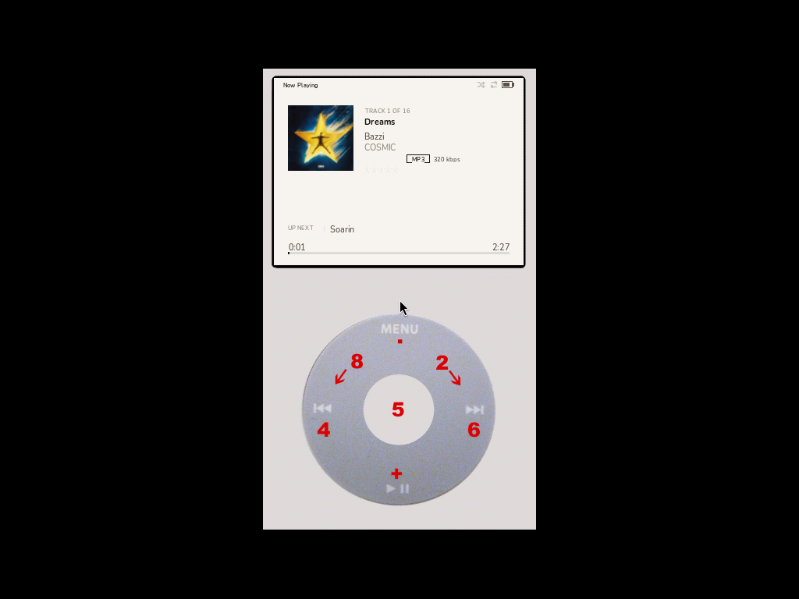
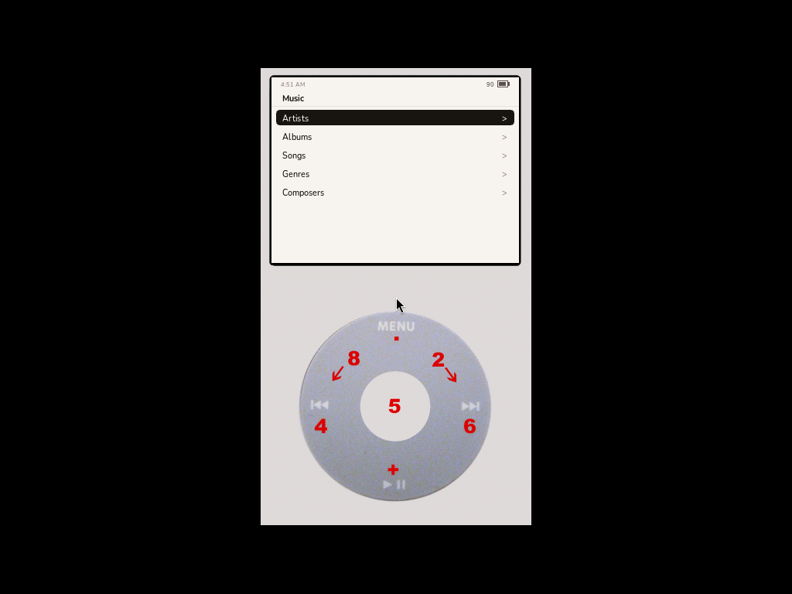
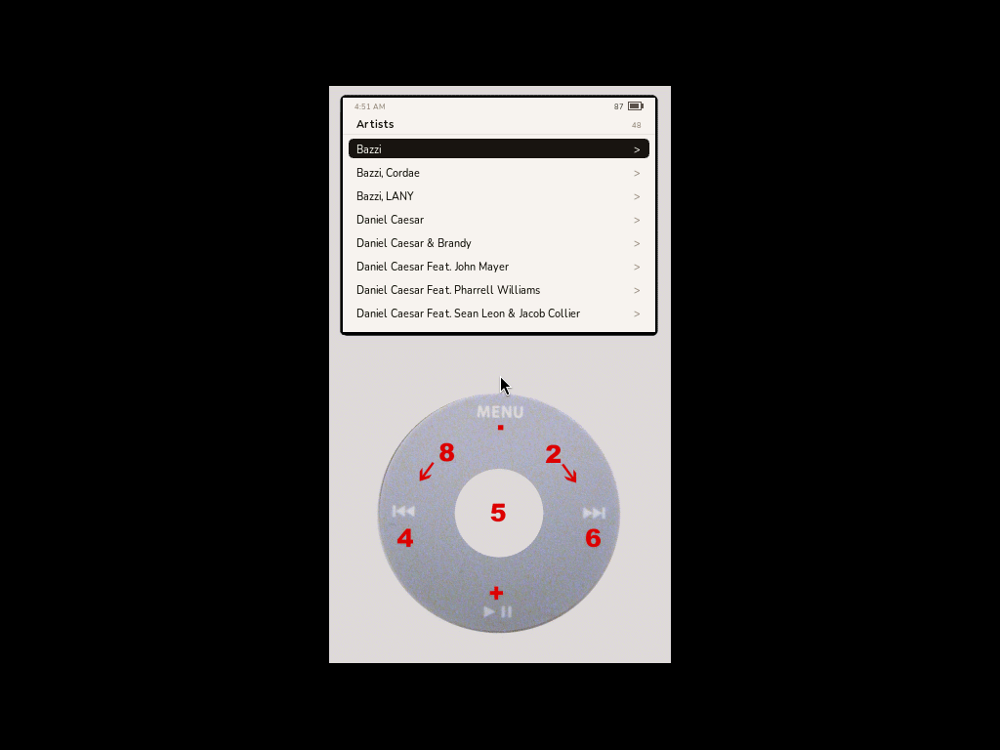
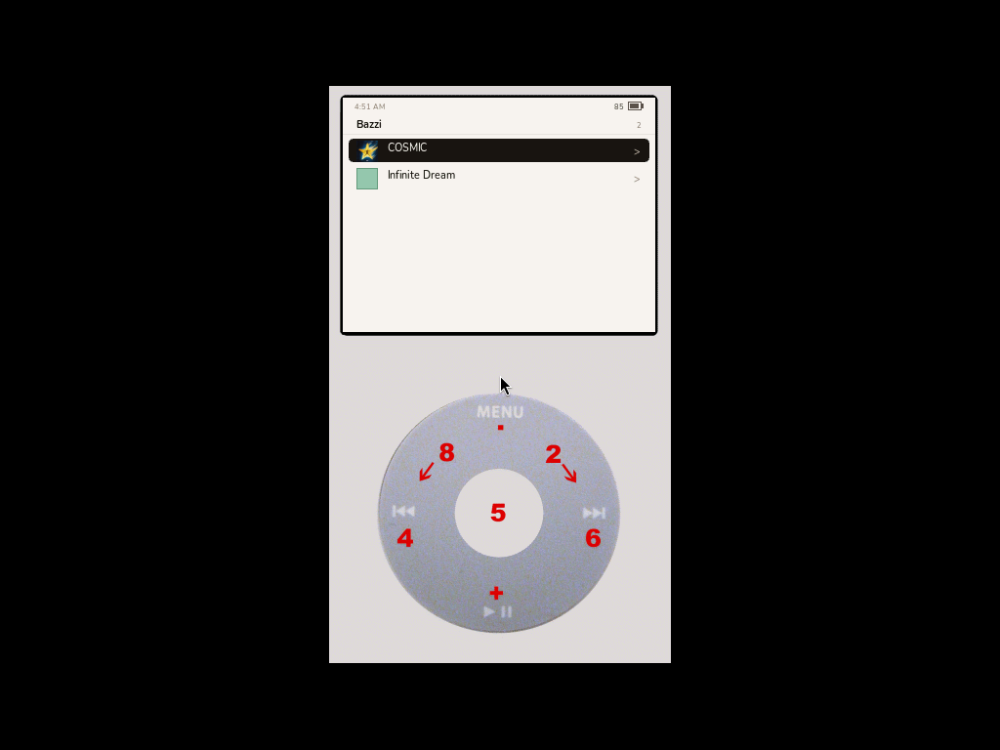
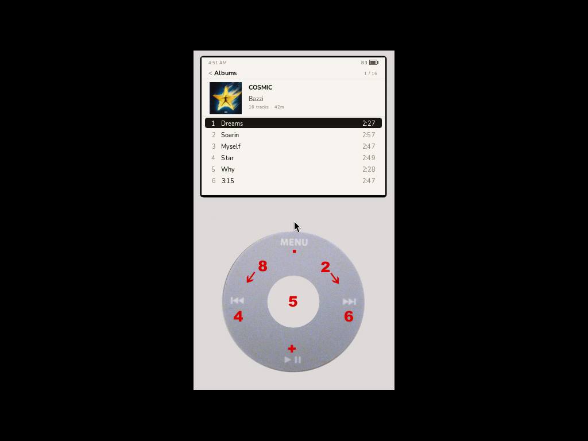
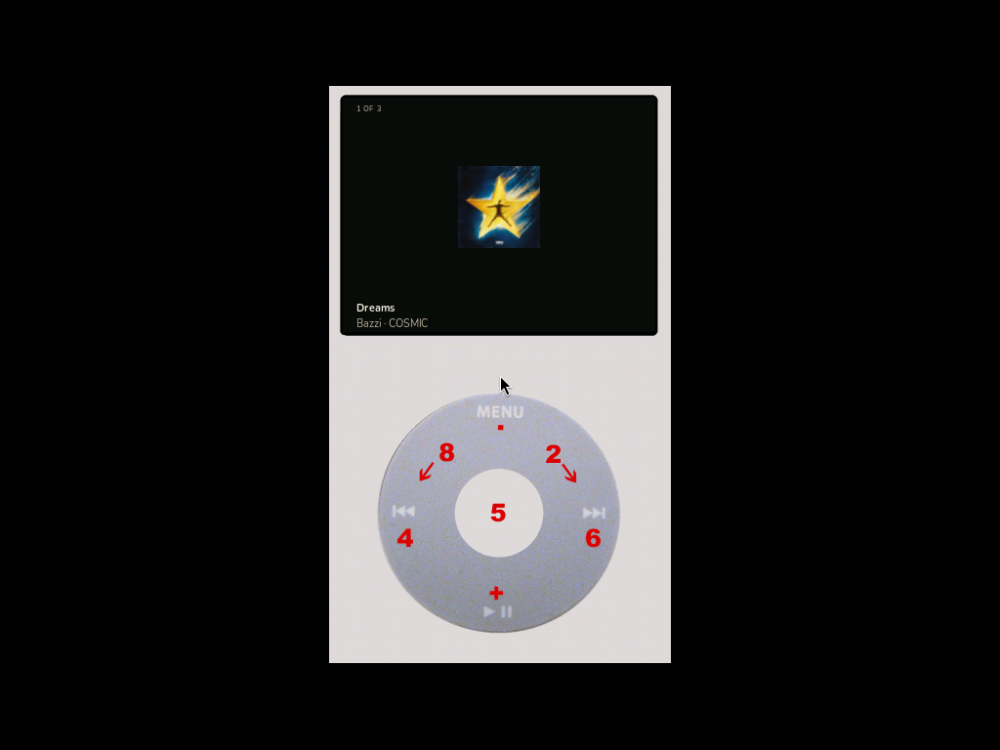
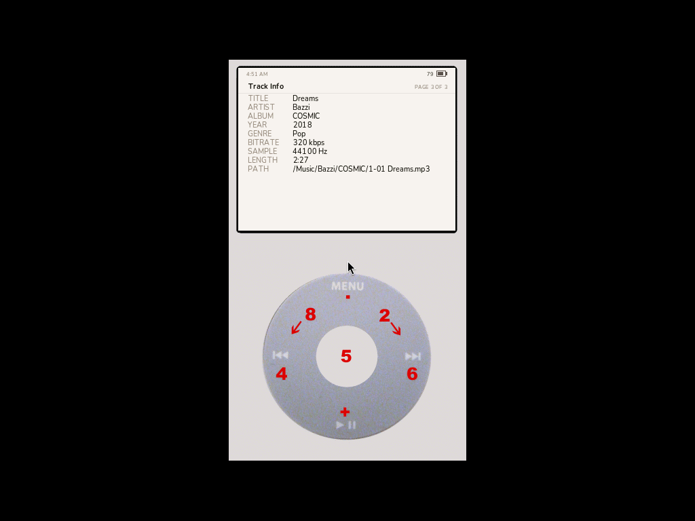
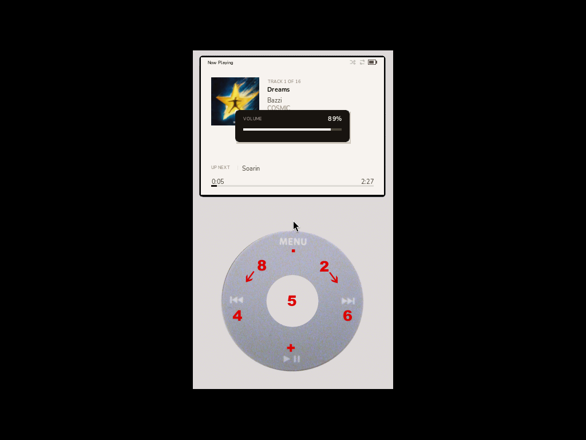

# Cabinet · Linen

A custom UI for [Rockbox](https://rockbox.org) on the iPod Video (5G).
**Linen** is a warm-light theme; **Cabinet** is a plugin that replaces
Rockbox's hardcoded main menu with a curated, design-driven interface.

Together they ship as a drop-in zip for any iPod Video already running
Rockbox.

---

 

## What's in this repo

```
design_handoff_rockbox_theme/  Original design files (JSX components + HTML)
theme/                         The Linen theme: .cfg, .wps, .sbs, fonts, bitmaps
plugin/                        The Cabinet plugin source (C, single file)
tools/                         Build helpers + headless test harness
docs/img/                      Screenshots from the headless sim test runs
build/                         Output zips ready to deploy
```

## Highlights

- **Theme:** Linen — warm cream `#F4F1EC`, ink `#1A1714`, terracotta accent.
  Custom Nunito font in 5 weights/sizes (9, 11, 13, 13-bold, 17-bold px),
  per-viewport colors, soft-rounded selector with anti-aliased corners,
  3-px progress bar, custom status bar.
- **Plugin:** Cabinet replaces the Rockbox main menu with the design's
  curated list (Music / Playlists / Podcasts / Audiobooks / Settings /
  Now Playing). Music browse chain (Artists → Albums → Songs) goes
  through Rockbox's tagcache via the `add_filter` API for correct
  filtering. Playback handoff routes through a fully custom 3-page
  Now Playing screen.

## Screenshots

### Cabinet — main menu


### Music sub-menu


### Artists list (live tagcache)


### Albums for artist (real album-art thumb on selected row)


### Album detail — hero header + tracklist (matches design's `AlbumDetail`)


### Now Playing — page 1 (Linen layout: art, title, artist, album, format badge, stars, up next, progress)


### Now Playing — page 2 (big art on dark backdrop)


### Now Playing — page 3 (track info)


### Volume overlay (transient, on wheel scroll during playback)


## Install

Pre-built zip: **`build/cabinet-linen-ipodvideo.zip`** (~50 KB).

1. Make sure your iPod Video already runs Rockbox
   ([install guide](https://www.rockbox.org/wiki/IpodVideo)).
2. Mount the iPod and copy the contents of the zip to its root. The
   `.rockbox` folder will merge with your existing one.
3. On the device:
   - **Settings → Theme Settings → Browse Theme Files → linen**
   - **Database → Initialize Now** (one-time scan)
   - **Plugins → Applications → cabinet** to launch the UI

Optional: make Cabinet the auto-launching start screen so the iPod boots
straight into our UI:

> Settings → General Settings → System → Start Screen → Custom →
> `/.rockbox/rocks/apps/cabinet.rock`

## Controls (in Cabinet)

| Action | Mapping |
|---|---|
| Scroll list / Volume on Now Playing | Wheel up/down |
| Prev/Next track on Now Playing | Left / Right |
| Drill in / Cycle NP info pages | Center (Select) |
| Pause / Resume | Play |
| Back | Menu |

Holding the wheel triggers fast-scroll (8-item jump) for browsing long
artist lists.

## Building from source

The plugin needs to be compiled against the Rockbox source tree.

```bash
# 1. Clone Rockbox
git clone https://git.rockbox.org/cgit/rockbox.git ~/rockbox

# 2. Drop our plugin into apps/plugins/ and add to SOURCES
cp plugin/cabinet.c ~/rockbox/apps/plugins/

# Add `cabinet.c` to ~/rockbox/apps/plugins/SOURCES (alphabetical, near `cab*`).

# 3. Get the cross-toolchain (for hardware) — interactive
~/rockbox/tools/rockboxdev.sh

# 4. Configure for the iPod Video target + build
mkdir -p ~/rockbox/build-ipodvideo && cd ~/rockbox/build-ipodvideo
../tools/configure         # pick `ipodvideo`, Normal build
make -j$(nproc) zip        # produces rockbox.zip with cabinet.rock inside
```

For sim testing on Linux:

```bash
mkdir -p ~/rockbox/build-ipodsim && cd ~/rockbox/build-ipodsim
echo "ipodvideo
S
N" | ../tools/configure
make -j$(nproc)
make fullinstall           # installs runtime to simdisk/
./rockboxui                # SDL window opens
```

A small headless test harness (Xvfb + xdotool + ffmpeg) is in
`tools/test_plugin.sh` — drives the sim through the menu/play flow and
captures PNGs into `build/headless/` so visual diffs can be reviewed via
the auto-refreshing index page (`tools/render_index.py`).

### Patches required for the Rockbox source

To build under glibc 2.38+ / gcc 15, two upstream files need `#undef`s
added (the build wraps `rb->memchr` etc. as struct-pointer calls that
collide with newer glibc's `_Generic` macros). See the README of the
Rockbox source tree, or the patch fragments below:

- `apps/plugin.h` — add `#undef strrchr / strstr / memchr` near the top
- `lib/rbcodec/codecs/lib/codeclib.c` — add the same `#undef`s before
  the redefinitions of `memchr / memmove / memcmp / memset / memcpy`

These don't affect older toolchains (the macros simply don't exist on
arm-elf-eabi gcc 9, which is what `rockboxdev.sh` installs).

## Design source

The design ships in `design_handoff_rockbox_theme/` as React/JSX
components — open `Rockbox Theme.html` in a browser (or run `python3 -m
http.server 8000` and navigate to it) to see the design at native 320×240
scale. The plugin and theme are pixel-tightened to match.

## What's intentionally not implemented

- **Peak-meter NP info page** — the Rockbox plugin API doesn't expose
  audio sample data; would need a core firmware change.
- **Charging / Locked-screen system overlays / Boot splash** — these
  are firmware-level, outside theme + plugin reach.
- **Podcasts, Audiobooks** as distinct types — Rockbox doesn't natively
  distinguish them; would need a folder convention.

## License

- Theme files (`*.cfg`, `*.wps`, `*.sbs`, `*.bmp`) and the Cabinet
  plugin: GPL-2.0-or-later, matching Rockbox.
- Nunito font: SIL Open Font License 1.1 (see `theme/OFL.txt`).
- Design files: original work, free to adapt.

## Credits

Designed and authored from scratch — no proprietary Apple or
Rockbox-stock assets used.
