# core — custom firmware for iPod Video 5G/5.5G

A from-scratch firmware that ships **Cabinet** as the shell and **Linen**
as the only theme. Replaces Rockbox entirely on the device.

The simulator runs the real C firmware against an SDL2 host backend, so
every screen below is rendered by the same code that will run on the
iPod.

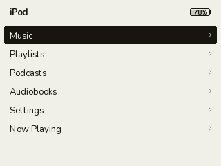 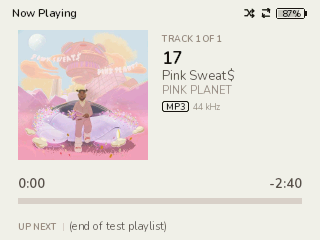 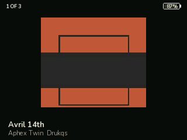

---

## Status

The music browser is feature-complete in sim — load, browse all four
iconic groupings (Artists / Albums / Genres / Composers), drill down,
play. Now Playing shows real metadata + embedded album art.

| Working today (sim) | Pending |
|---|---|
| FLAC + MP3 decoders (bit-exact via codec KAT) | Bootable ARM image (Phase 1) |
| Audio engine — SPSC ring + SDL2 HAL | On-device USB / disk / battery |
| Library scan + tag parse (Vorbis, ID3v2.3/2.4) | Playlists, podcasts, audiobooks |
| Drilldown: Artists → songs, Albums → songs, Genres → songs, Composers → songs | Per-track gain (replaygain) |
| Embedded album art (FLAC PICTURE, MP3 APIC → JPEG → 84² + 180²) | Volume / brightness (need HAL knobs) |
| Binary tagcache (`.tcdb`) — Go-side encoder + C-side reader |  |
| Search frame — on-screen keyboard, live substring filter |  |
| Settings — light / dark theme cycle + About screen |  |
| End-to-end audio playback test (captures real PCM, bit-compares to reference) |  |

35 PRs squash-merged on `main`. See [`STATUS.md`](STATUS.md) for the
running list.

---

## Quick start (sim)

Requires `meson`, `ninja`, `pkg-config`, `libsdl2-dev`, and a C11
compiler. Run `tools/install_deps.sh` for a one-shot setup.

```bash
cd core
make sim                                  # builds build-sim/sim/core-sim
./build-sim/sim/core-sim                  # synthetic data — empty library
./build-sim/sim/core-sim --music ~/Music  # scan a real directory at startup
meson test -C build-sim                   # codec KAT + .tcdb parser + audio playback
```

Wheel = scroll, center = SELECT, MENU = back, SPACE = pause/resume.

---

## Screenshots

All captured headlessly via `core-sim --shot <path.bmp>` against a
six-track tagged library; the same code path runs in interactive mode.

### Cabinet shell — main menu and Music sub-menu
 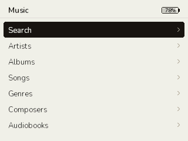

### Search — on-screen keyboard with live results
Wheel cycles the highlighted key (or, with focus shifted via RIGHT,
the result list); SELECT types / plays. Substring match,
case-insensitive ASCII against song titles.

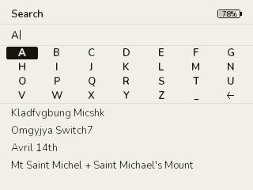

### Settings — light / dark theme
Settings → **Theme** cycles between Light and Dark; everything except
album art flips. **About** shows firmware version + library counts.

| Light | Dark |
|---|---|
| 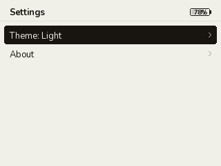 | 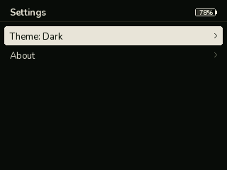 |

| Main menu, dark | About |
|---|---|
| 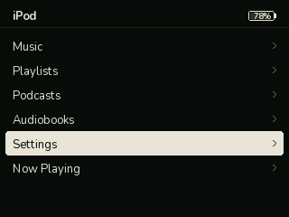 | 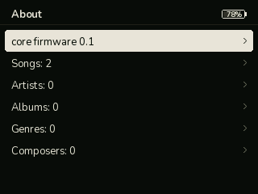 |

### Library views (all backed by the tagcache)
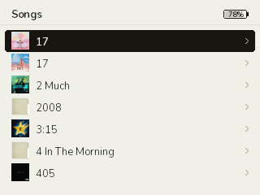 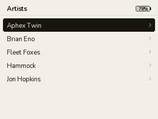

### Genres / Composers — same shape as Artists/Albums
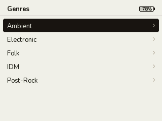 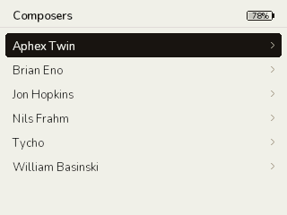

### Drilldowns — pick a row, see its songs
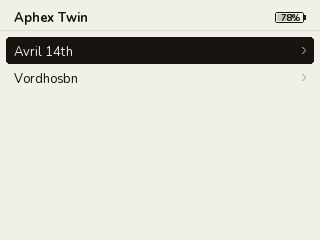 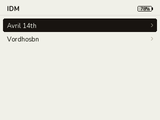

### Now Playing — four cycle-able pages
The iconic iPod NP screen. Embedded album art renders at 84² on the
default page and 180² on the big-art page; SELECT cycles pages, MENU
pops.

| Default | Big art |
|---|---|
|  |  |

| Peak meter (synthesized) | Track info |
|---|---|
| 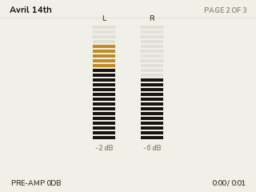 | 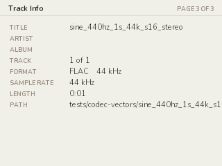 |

---

## Binary tagcache

Real iPod hardware can't afford a scan-at-startup pass — even a small
library on a USB-disk takes seconds-to-minutes to walk and re-parse
every tag. The `core` host CLI builds a precomputed binary index the
firmware mmaps at boot.

```bash
cd core/cli
go build -o /tmp/core ./cmd/core
/tmp/core tagcache build ~/Music
# ~/Music/tagcache.tcdb: 1834 songs, 142 artists, 218 albums, 17 genres, 89 composers (412 KB)

cd ..
./build-sim/sim/core-sim --tagcache ~/Music/tagcache.tcdb
```

Format spec: [`core/apps/db/tagcache_format.h`](core/apps/db/tagcache_format.h)
(C side) and [`core/cli/internal/tagcache/format.go`](core/cli/internal/tagcache/format.go)
(Go side). Both sides have round-trip tests; a layout drift fails both
simultaneously.

---

## Repo layout

```
core/                     C firmware + simulator
├── boot/                 (empty — Phase 1)
├── kernel/               (empty — Phase 1)
├── hal/
│   ├── hal.h             contract
│   ├── hw/               (empty — needs hardware)
│   └── sim/              SDL2-backed implementation
├── codecs/
│   ├── tags.h            shared audio_tags_t (incl. owned art bytes)
│   ├── decoder.h         unified decoder ABI
│   ├── dr_flac/          vendored single-header FLAC + Vorbis comments
│   ├── dr_mp3/           vendored single-header MP3 + custom ID3v2 parser
│   └── stb_image/        JPEG-only build for embedded album art
├── apps/
│   ├── audio/            decoder → SPSC ring → hal_audio engine
│   ├── db/               tagcache: scan, parse, build indexes, .tcdb reader
│   └── ui/               Cabinet shell, list view, Now Playing, Linen chrome
├── cli/                  Go host CLI (build / install / update / tagcache build)
├── sim/                  core-sim entry point
├── docs/hw/              Phase-0 hardware reference (8 subsystems, ~2,500 lines)
└── tests/                codec KAT + .tcdb reader + end-to-end audio playback

design_handoff_rockbox_theme/  Original design files (JSX + HTML)
docs/img/                       Sim screenshots (this README)
tools/                          Build helpers (atlas generator, deps installer)
```

See [`core/README.md`](core/README.md) for the firmware-side build details
and [`PLAN.md`](PLAN.md) for the phased roadmap.

---

## Verifying audio actually plays

The `sim-audio-playback` integration test spawns `core-sim` with the
SDL2 `disk` audio driver, drives Music → Songs → SELECT, and bit-
compares the captured S16LE samples against the codec KAT reference.
This catches regressions anywhere in the chain — tagcache, cabinet's
play path, audio engine, ring buffer, or HAL audio source callback.

```bash
cd core
meson test -C build-sim --suite integration
# 2/2 integration - core:sim-audio-playback OK     6.74s
# stdout: ok: 176400 bytes of audio matched (capture started at byte 0)
```

To listen interactively, drop `--shot` and use `--music`:

```bash
./build-sim/sim/core-sim --music ~/Music
```

---

## License

Apache-2.0 first-party; vendored codecs (`dr_flac`, `dr_mp3`,
`stb_image`) keep their upstream licenses (zlib / public domain / MIT).
Nunito font: SIL Open Font License 1.1 (`tools/fonts-src/`).
