# core

A from-scratch firmware for the iPod 5.5G. It is written in C and ARM assembly, boots as the
device's own OSOS image, reads FLAC off the iPod's disk and plays it through a designed
interface: Nunito type, seven palettes, album art, a status strip, a Hold banner. Apache-2.0,
no Rockbox code.

<p align="center">
  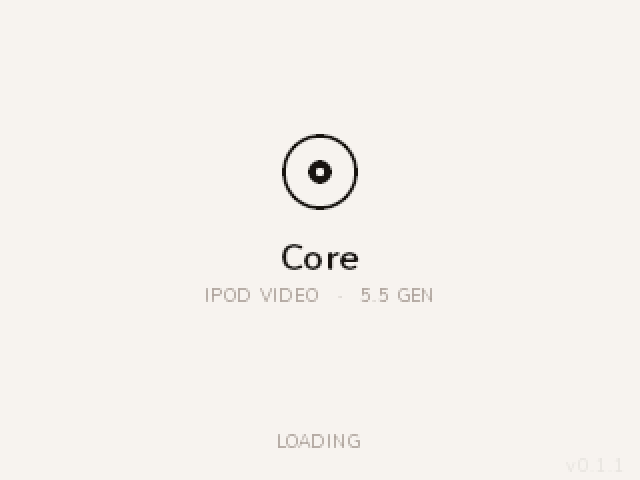
  <br><em>Cold boot to Now Playing. Host render of the device UI, not a photo.</em>
</p>

New to the device? Read the [user guide](docs/USER_GUIDE.md).

## What it does

- **Boots as the firmware.** No chainloader, no boot menu. The image is the OSOS in the firmware
  partition; the boot ROM hands to `crt0.S`. Select + Play still reaches Apple's disk mode, so
  recovery is unconditional.
- **Plays FLAC and MP3 from the disk.** Streaming decode over an anti-skip buffer, DMA to the
  WM8758B, and a track hand-over that does not stop the DAC. MP3 is MPEG-1/2/2.5 Layer III, CBR and
  VBR, through a fixed-point decoder (AOSP's pvmp3) — the 8–16 kHz rates are refused, because the
  DAC cannot be clocked there. Whether MP3 holds real time on this 80 MHz ARM7TDMI has not yet
  been measured on the device; Settings → About → Boot Details shows the decode cost as a
  percentage of the budget.
- **Loads the library in one read.** A host-built index (`CORELIB.IDX`) with up to 6000 songs,
  1024 albums, 512 artists and 128 genres, full UTF-8. Album-art sidecars for list chips and the
  Now Playing cover.
- **Browses by playlist, artist, album, song and genre, and searches.** Two-line rows, art chips,
  a marquee for long titles, an artist's whole discography as one list, `.m3u8` playlists read from
  the disk, an A–Z letter on every long list, and a Search that types on the wheel and matches
  titles, artists, albums and playlists — through accents and curly apostrophes.
- **Draws real type.** A libc-free, gamma-correct text renderer with six Nunito atlases, kerned
  and tracked from measured ink.
- **Has seven themes.** Linen, Onyx, Sage, Plaster, Olive, Umber, Mushroom. The selection bar is
  always the theme's ink behind its surface, so every screen inverts with the theme.
- **Remembers.** Settings, the resume position and the queue it was in persist to a pre-allocated
  file on the disk, CRC-checked, never moving a cluster. A 4 MiB on-disk event log captures every
  diagnostic line.
- **Sleeps.** Hold Play to sleep, or set a sleep timer of 15 to 120 minutes; the drive parks, the
  panel and codec go down, the CPU idles. On battery, a sleeping device powers itself off after
  thirty minutes.
- **Knows what time it is.** The PMIC's always-on clock, read at boot and carried in software, with
  the time optionally in the title bar. The iPod cannot be told the time over the cable — on it,
  Apple's disk mode is what answers the computer — so `core sync` and `core eject` leave the time in
  the settings file and the device takes it at the next boot.

## Screens

Every image below is drawn by `docs/screens/render.py` with the firmware's own glyph atlases and
palette; see the [user guide](docs/USER_GUIDE.md) for what each control does.

### Library

Main menu, Music, and the lists. An artist's All Songs row is the whole discography with the album
on the sub-line.

<p align="center">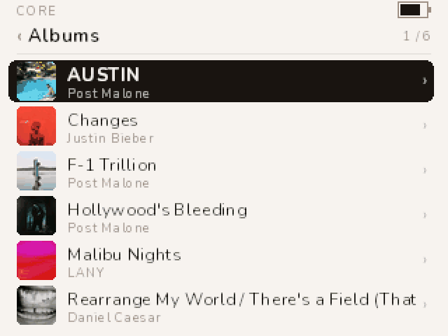</p>

<table>
  <tr>
    <td></td>
    <td></td>
    <td></td>
  </tr>
  <tr>
    <td>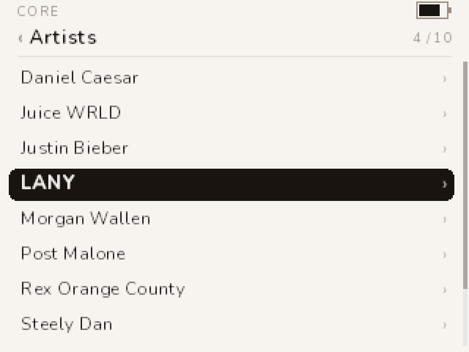</td>
    <td>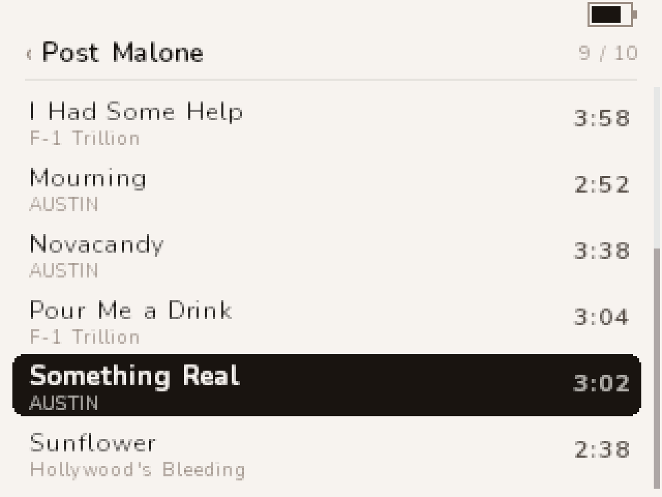</td>
    <td>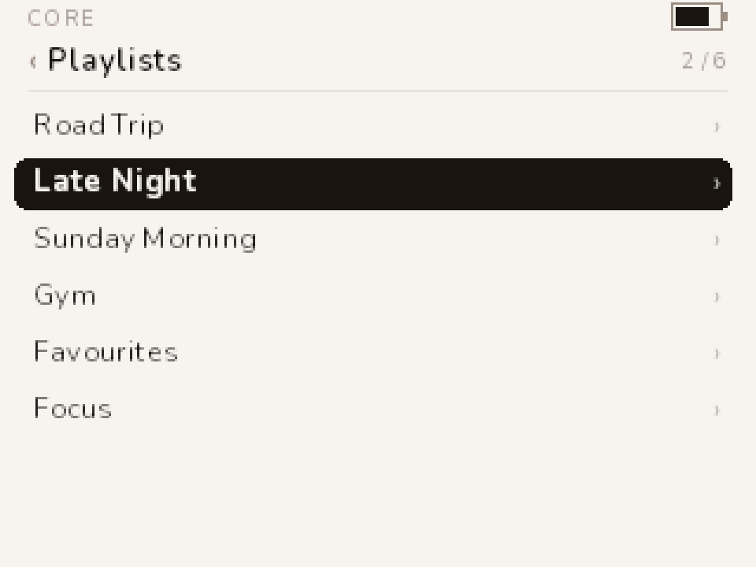</td>
  </tr>
</table>

### Finding things

Spin the wheel fast on any long list and the letter it is sorted by comes up; a click then moves a
whole letter. Music → Search types on the wheel and matches as you go.

<table>
  <tr>
    <td>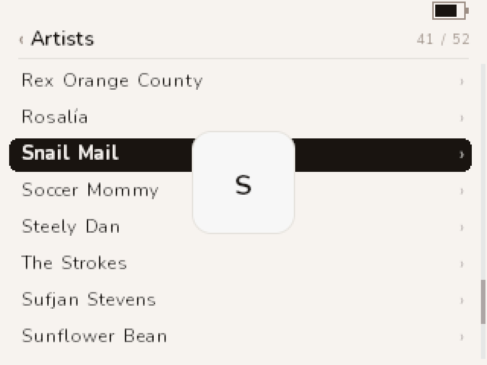</td>
    <td>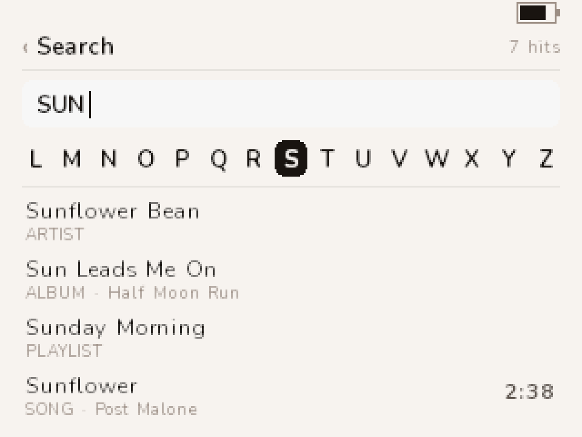</td>
    <td>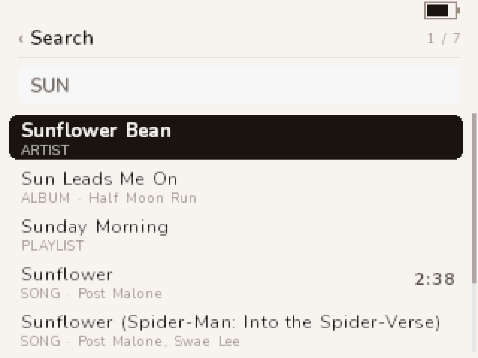</td>
  </tr>
</table>

### Now Playing

Cover, title, artist, album, track count, times and a progress bar. The wheel sets the volume; a
Select tap turns it into a scrubber. Right on any list jumps here, and Menu returns to the row you
left.

<p align="center"></p>

<table>
  <tr>
    <td></td>
    <td></td>
    <td>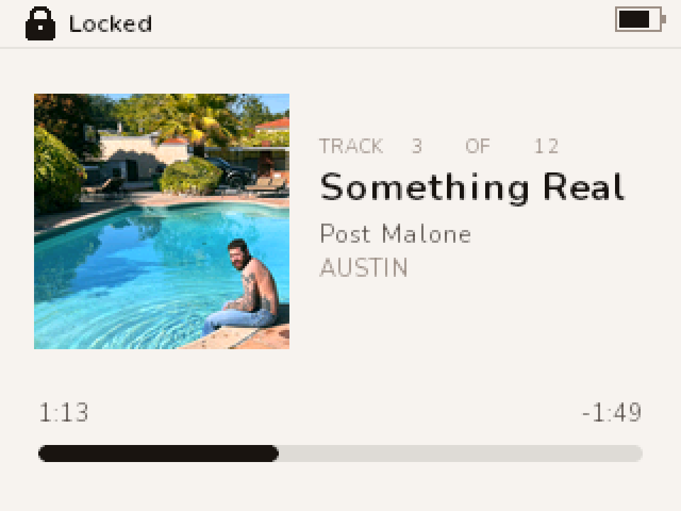</td>
  </tr>
</table>

### Themes

Seven palettes, swapped live from Settings. Same layout, same type, different ink and surface.

<p align="center">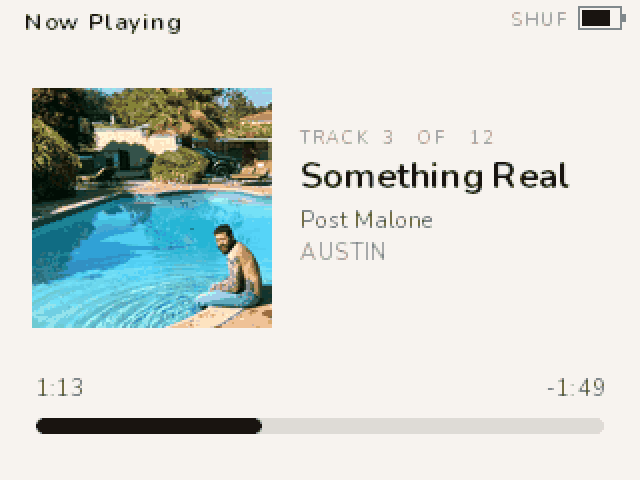</p>

<table>
  <tr>
    <td></td>
    <td></td>
    <td></td>
  </tr>
</table>

### Settings

Playback, Sound (volume limit, EQ presets, tone), Theme, Display, Clicker, Date & Time, About, Boot
Details, Disk Mode, Reset. Everything but the diagnostics is saved to the disk.

<p align="center">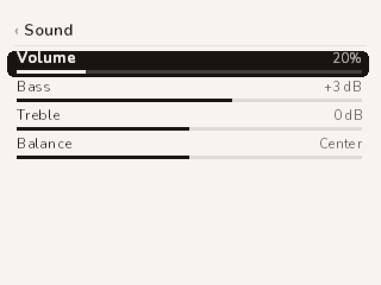</p>

<table>
  <tr>
    <td></td>
    <td>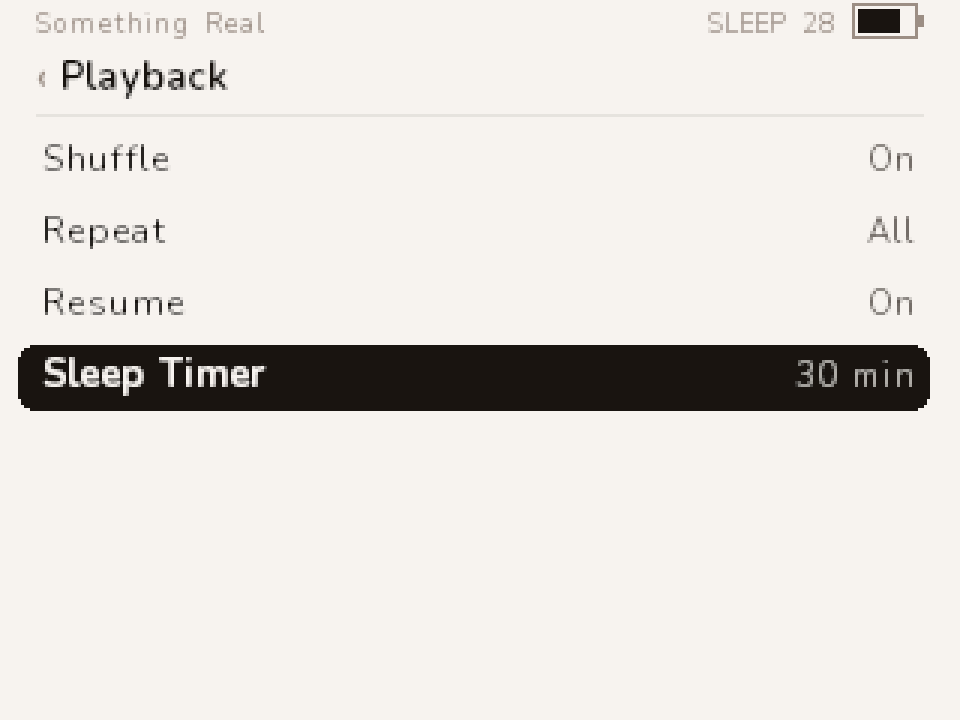</td>
    <td>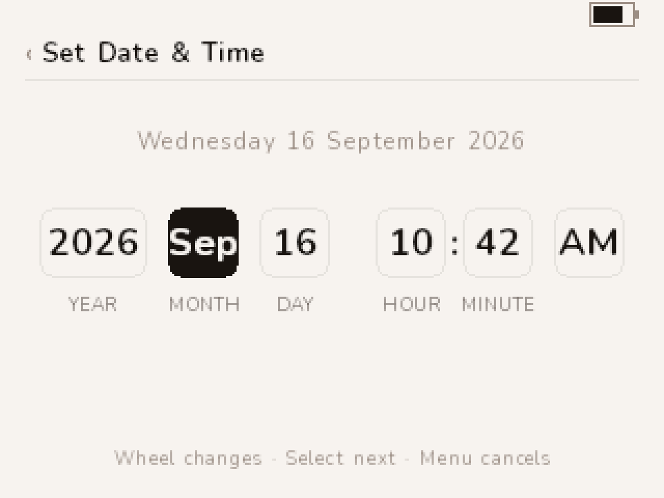</td>
    <td></td>
  </tr>
</table>

### System

The boot screen is one screen from power-on to the menu; the bar fills as the library loads, in
your theme. Low battery is a toast, then a full-screen warning at the disk-safe line, then a
goodbye.

<p align="center">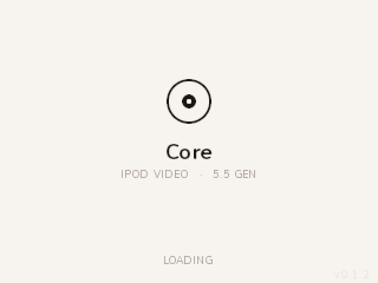</p>

<table>
  <tr>
    <td>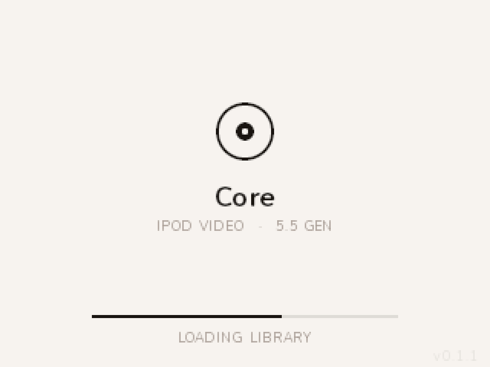</td>
    <td></td>
    <td></td>
  </tr>
</table>

## Hardware

| | |
|---|---|
| Device | iPod 5.5G (Video), 80 GB |
| SoC | PortalPlayer PP5022, two ARM7TDMI cores, no FPU |
| Audio | Wolfson WM8758B, I²C control, I²S data, DMA |
| Display | 320×240 through the BCM framebuffer |
| Storage | ATA in PIO, FAT32 read, in-place writes to two pre-allocated files |
| Input | Click wheel, five buttons, Hold switch |
| Boot | The OSOS image in the firmware partition; Boot Details reports the cold boot live |
| Recovery | Select + Play at power-on, in the boot ROM |

Hardware notes the drivers were written against: [`core/docs/hw/`](core/docs/hw/).

## Build

Needs `meson`, `ninja`, `pkg-config`, a C11 host compiler, and `arm-none-eabi-gcc` with binutils
and newlib for the device.

```bash
cd core
make hw                        # build-hw/core.elf, core.bin
make ipod                      # build-hw/core.ipod
make sim && meson test -C build-sim   # host tests, 74 suites
make verify-hw                 # layout, header/doc and size checks on the ARM image
```

Detail, sanitizer builds and the host tools: [`core/README.md`](core/README.md),
[`tools/README.md`](tools/README.md).

## The `core` app

One binary on your computer does the host side: it puts the music on the iPod in the layout the
firmware reads, bakes the art sidecars, writes the index, flashes firmware and fetches updates.
Download the one for your machine from the
[latest release](https://github.com/BrandonDedolph/ipod-core/releases/latest) — attached from
v0.1.3 on, or build it from [`core/cli/`](core/cli/README.md).

| File | For |
|---|---|
| `core-windows-amd64.exe` | Windows |
| `core-darwin-arm64` | macOS, Apple silicon |
| `core-darwin-amd64` | macOS, Intel |
| `core-linux-amd64` | Linux, x86-64 |
| `core-linux-arm64` | Linux, ARM |

The same five come as `core-app-*`: a desktop window over the same code, for people who would
rather press Sync than type it. On Windows it asks for Administrator when it opens, then reads and
flashes the iPod itself.

<p align="center">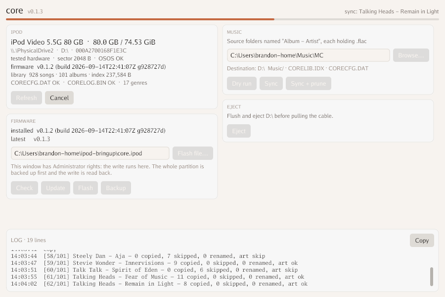</p>

```bash
core info                                   # identify the iPod, in disk mode
core sync --src ~/Music --dst /media/IPOD   # files, art, playlists, index
core eject /media/IPOD
core update                                 # newest firmware release, verified and flashed
```

The walkthrough is in the [user guide](docs/USER_GUIDE.md#the-core-app). The 5.5G 80 GB is the only
model the firmware has booted on and the only one the app knows; `core flash` refuses other hardware
without `--untested-hardware`. Its flash path has written to that device and been read back by
both `core` and `ipodpatcher`.

## Flash

The image replaces Apple's firmware, so you need an iPod 5.5G and a backup of its firmware
partition. `core flash` takes that backup itself, writes only the OSOS image and its directory row,
and compares the read-back. Paths are relative to `core/`, as in Build.

```bash
core flash build-hw/core.ipod                    # iPod in disk mode
```

ipodpatcher is the documented fallback:

```bash
ipodpatcher <disk> -r bootpartition-backup.bin   # once
ipodpatcher <disk> -wf build-hw/core.ipod        # iPod in disk mode
ipodpatcher <disk> -rfb readback.bin
cmp readback.bin build-hw/core.bin               # identical, or do not boot it
```

If a build does not boot, hold Select + Play at power-on. That is Apple's disk mode in the boot
ROM; nothing this firmware writes can remove it. Reflash, or restore the partition with
`core flash --from-backup <file>` (ipodpatcher `-w`).

## Status

Runs on the device: direct boot, FLAC playback, the library, themes, settings and resume, sleep
and power-off, the event log. Built but not yet flashed: MP3 playback, Search, and the A–Z letter
on every list. Not there: writing playlists, podcasts. MP3 decodes correctly and within budget on
the host; whether it holds real time on the device is the next bench. The running list of what
works and what is next is [`STATUS.md`](STATUS.md).

Versions are git tags, `v0.1.0` and up. The boot screen's bottom-right stamp and Settings → About
show the version the device runs; an untagged build shows the nearest tag, the commit distance and
the hash, for example `v0.1.0-3-g7617196`. What changed in each release is in
[`CHANGELOG.md`](CHANGELOG.md) and on the GitHub release, which carries the flashable `core.ipod`.

## Design

The interface comes from a design reference built at the panel's native 320×240: palette tokens,
chrome, list rows, Now Playing, the system screens. The firmware implements it directly in C;
where the two differ the reference notes say so. [`design_reference/`](design_reference/).

## Layout

```
core/         firmware: boot/, kernel/, hal/, fs/, codecs/, ui/, library/, player/, tests/, docs/
core/cli/     the core app: info, sync, index, art, backup, flash (Go)
tools/        host tooling: atlases, and the Python oracles the core app is checked against
docs/screens/ the screenshots and GIFs in this README, and the renderer that draws them
docs/         the user guide
design_reference/  the UI design source
STATUS.md     what works, what is pending, what is next
```

## License

Apache-2.0 ([`core/LICENSE`](core/LICENSE)). The vendored FLAC decoder `dr_flac` is public domain /
MIT-0; the MP3 decoder is PacketVideo's `pvmp3` from AOSP, Apache-2.0, vendored at a pinned commit
with its NOTICE and its patent disclaimer
([`core/codecs/pvmp3/`](core/codecs/pvmp3/README.md)). Nunito is under the SIL Open Font
License 1.1 ([`tools/fonts-src/OFL.txt`](tools/fonts-src/OFL.txt)).
