# Using core

This guide describes Core v0.1.2. The device shows its version bottom-right on the boot screen and
in Settings → About; Boot Details shows the full build string.

This is the guide for the person holding the iPod. It covers the controls, every screen, the `core`
app that puts music on the device and flashes it, power, and what to do if something goes wrong.
Building the firmware from source is in the [README](../README.md).

## Controls

The click wheel scrolls. The centre button is Select. Menu is the top of the wheel, Play at the
bottom, Left and Right at the sides. The Hold switch is on the top edge.

| Control | On lists and menus | On Now Playing |
|---|---|---|
| Wheel | Moves the selection | Volume. After a Select tap, seeks |
| Select | Opens the row. On a track, plays it | Tap: scrub mode. Hold: the queue |
| Menu | Back one screen | Back to the screen you came from |
| Play | Tap: pause or resume. Hold two seconds: sleep. Hold longer: power off | Same |
| Right | Jumps to Now Playing if a track is loaded, playing or paused | Next track |
| Left | Nothing but the click | Previous track |

Right on a list pushes Now Playing over it, so Menu brings you back to the exact row you left.
Left and Right skip tracks only on Now Playing and the queue. Play works everywhere.

On the Songs list only, spinning the wheel fast puts the selected row's first letter on screen so
you can aim. The letter stays for just over a second after you stop.

Hold Play for two seconds to sleep. Keep holding past five seconds and the device powers off
instead. Any button wakes a sleeping device where you left it. A powered-off device cold boots on
the next press.

<p align="center">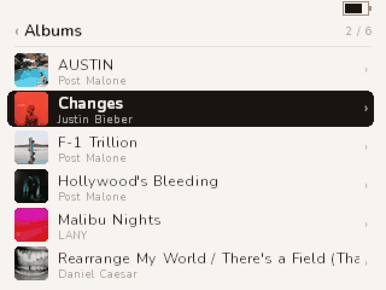</p>

## The Hold switch

Slide Hold on and a banner takes the top of the screen for a second: a padlock and Locked. Buttons
and the wheel do nothing while it is on; a press shows the banner again. A small padlock stays in
the status strip. Slide it off for the Unlocked banner. Touch the wheel or a button and the banner
goes away at once.

<p align="center">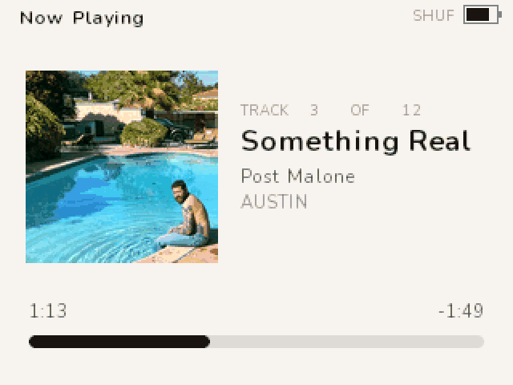</p>

## The status strip

The band at the top of every list and every Settings screen shows the playing track's name on the
left and the battery on the right, with the padlock between them when Hold is on. When nothing is
loaded the left side is blank. On Now Playing the band reads Now Playing or Paused, with SHUF and
RPT tokens when shuffle or repeat are on.

## Browsing

<table>
  <tr>
    <td>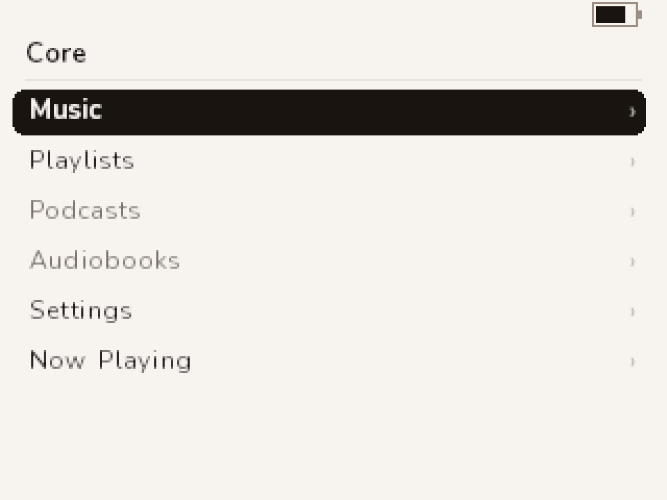</td>
    <td>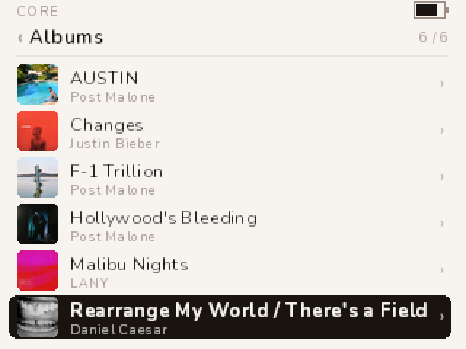</td>
    <td>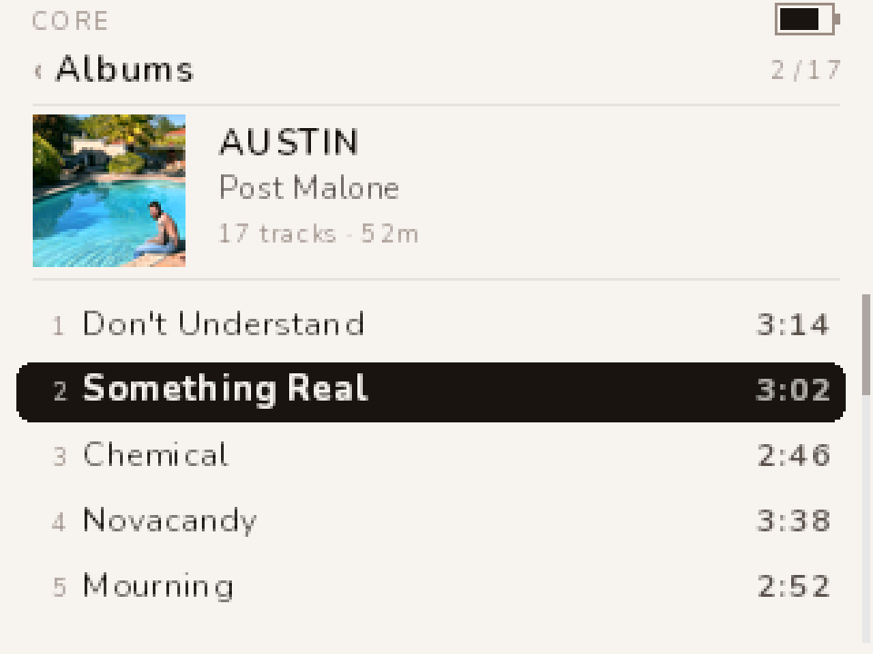</td>
  </tr>
</table>

**Main menu.** Music, Playlists, Settings, and Now Playing once something is loaded. Podcasts and
Audiobooks are greyed placeholders.

**Music.** Playlists, Artists, Albums, Songs, Shuffle Songs, Genres. Composers and Audiobooks are
greyed placeholders.

**Albums** lists every album with its cover chip and artist. Select opens the album: cover, title,
artist, track count and length, then the tracks with their numbers and durations. Select on a
track plays the album from there.

**Artists** lists artists; Select shows that artist's albums with an All Songs row at the top that
is the whole discography, album on the sub-line.

**Songs** is every song in the library. **Genres** lists genres with a count each. **Shuffle
Songs** deals the whole library and starts playing.

**Playlists** are `.m3u8` files you put in `Music/Playlists/` on the disk (see Putting music on
it). Select one to see its tracks; Select a track to play the playlist from there.

The header's right side shows where you are in the list, for example `6 / 17`. A long title
scrolls while it is selected.

## Now Playing

<table>
  <tr>
    <td>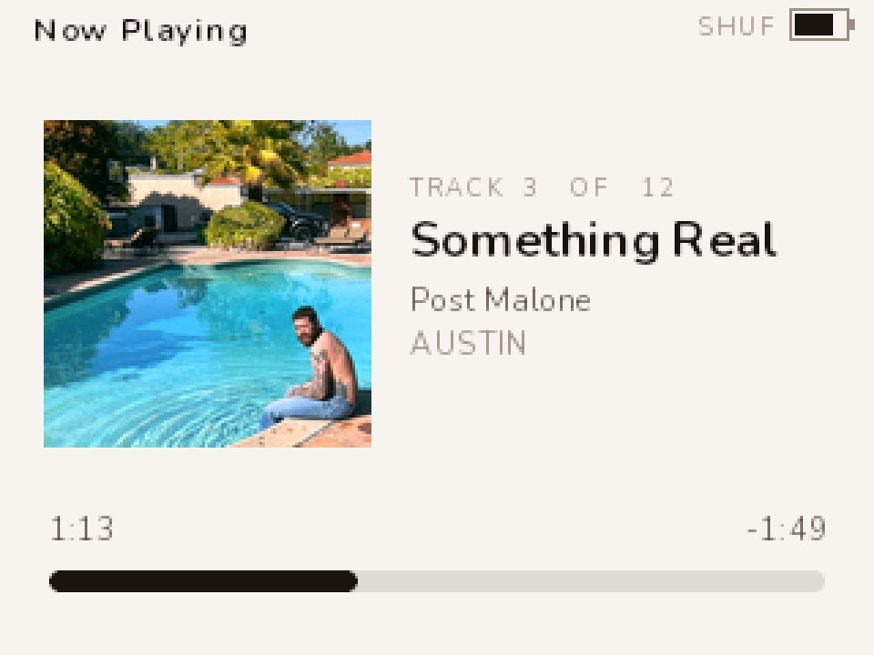</td>
    <td>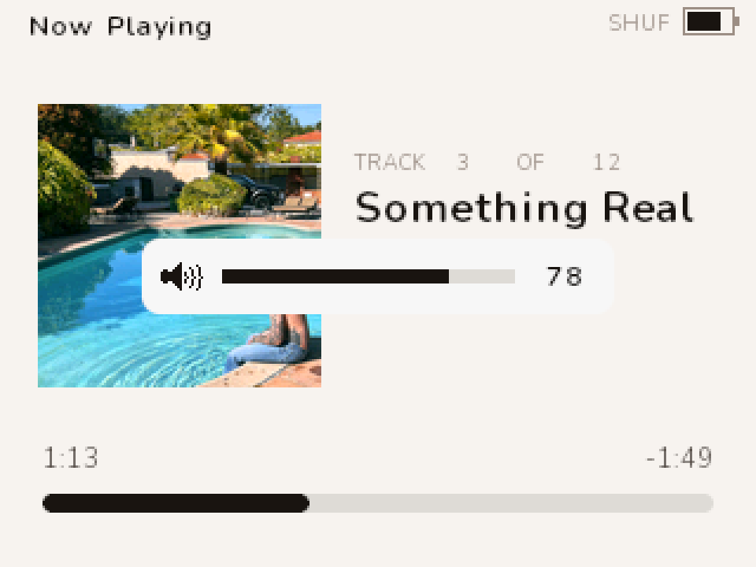</td>
  </tr>
</table>

The cover, then the eyebrow `TRACK 3 OF 12` (your place in the queue), the title, the artist, the
album. At the bottom the elapsed time, the time remaining, and the progress bar.

**Volume.** Turn the wheel. A bar appears for a moment; the speaker icon grows sound waves as it
goes up and shows a cross at zero.

**Scrubbing.** Tap Select. The wheel now moves the play position five seconds per click, more per
click the faster you turn. The left time shows where you are aiming and the right time shows how
far that is from where playback is, as a signed figure. Stop turning and it seeks after about four
tenths of a second. Leave it alone for four seconds and the wheel goes back to volume.

**The queue.** Hold Select for about half a second. The queue view lists what is playing and what
is next, with the playing row marked. Select a row to jump to it; Menu returns to Now Playing.
Left and Right skip here as well.

**Shuffle and repeat** are in Settings, Playback. They show as SHUF and RPT (or RPT1) in the top
band.

**When a track ends** while you are browsing, the name in the status strip changes. Nothing pops
up.

## Settings

<table>
  <tr>
    <td>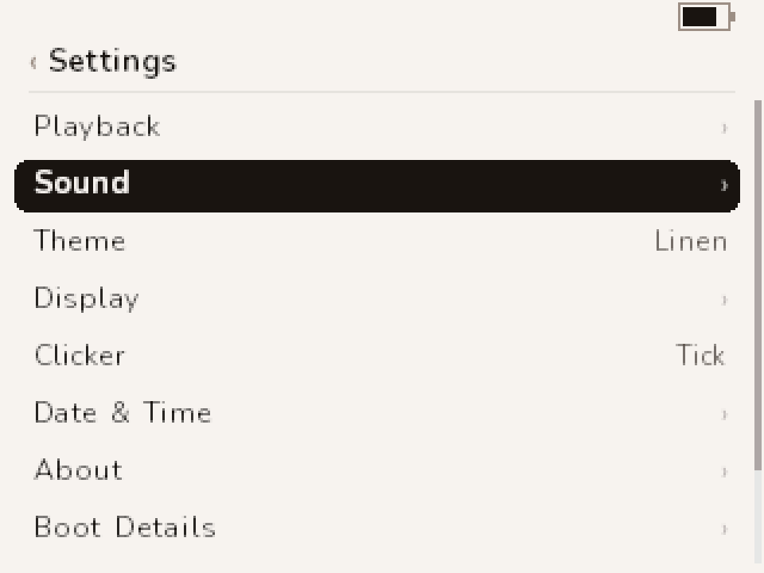</td>
    <td>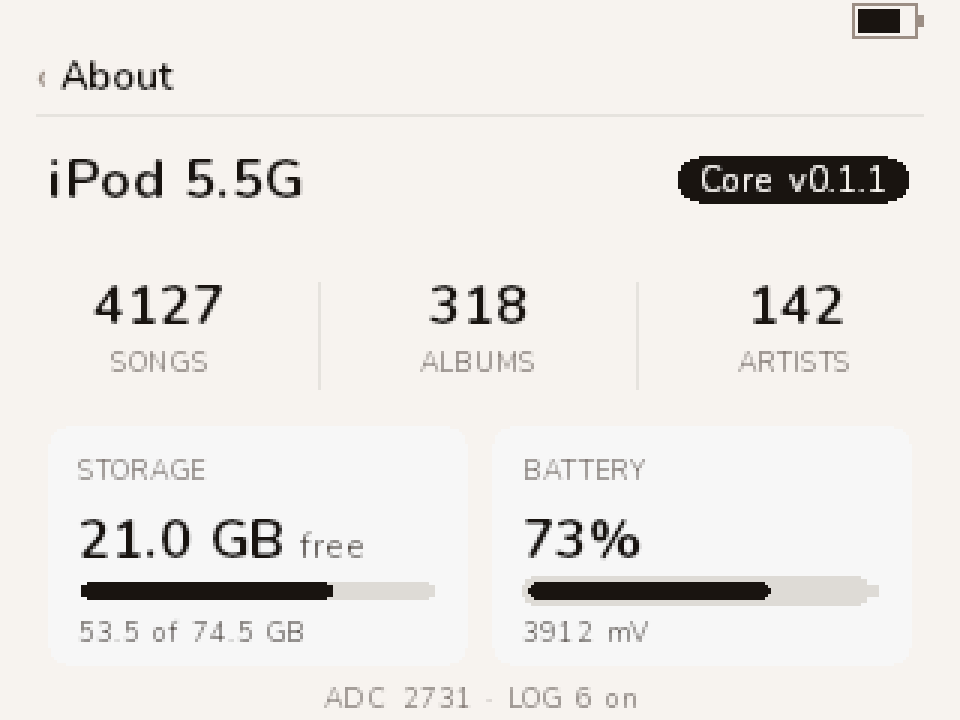</td>
    <td>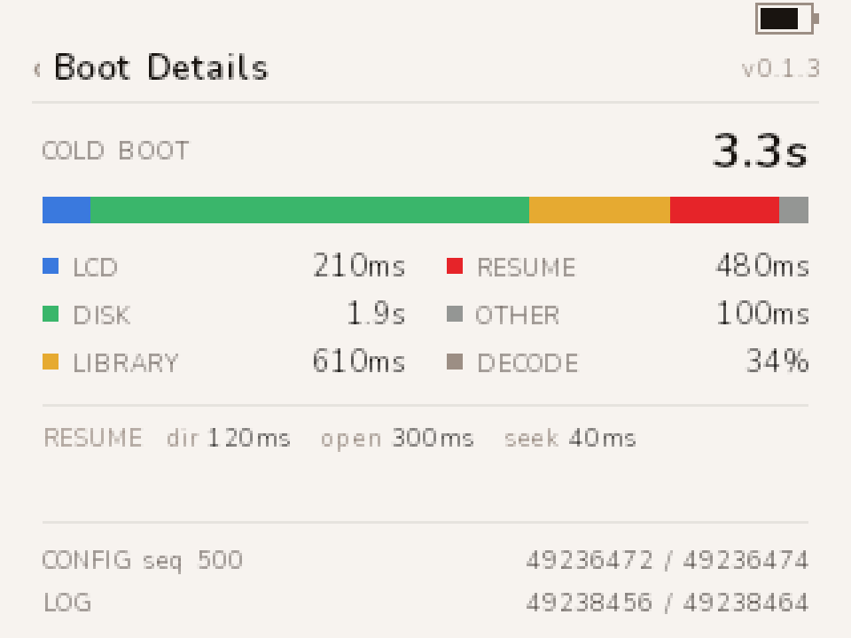</td>
  </tr>
</table>

Select a row to open it. On a slider, Select starts editing, the wheel changes the value, and
Select or Menu finishes. Every change is saved to the disk; if the drive happens to be asleep the
save waits until it next spins, or until the device sleeps or powers off, so leaving Settings
never makes you wait.

- **Playback.** Shuffle on or off. Repeat Off, All, or One. Resume on or off: with Resume on, the
  next boot comes back on the track you were on, paused at the same position, in the same queue.
  Turning Resume off also forgets the stored position.
- **Sound.** Volume, Bass and Treble (plus or minus 12 dB), and Balance. These drive the WM8758B
  directly.
- **Theme.** Seven palettes. The current one is marked; Select switches at once.
- **Display.** Backlight: Never, or 5, 10, 15, 30 or 60 seconds after the last input. At the
  timeout the light drops to a quarter of your brightness, and fifteen seconds later it goes off.
  Brightness: 1 to 32, shown as a percentage.
- **Clicker.** The click the wheel makes: Off, Tick, Click, Pop, Blip, Tock, Double, Chirp.
- **About.** The firmware version, model, song, album and artist counts, storage free, battery
  percentage and voltage, and the event log's state.
- **Boot Details.** The full build string, how long the last cold boot took and where it went
  (LCD, disk, library, resume, other), the FLAC decode cost against real time, audio underruns,
  and the disk addresses of the settings file and the log. Reading it never wakes a sleeping drive.
- **Disk Mode.** Saves everything and reboots into Apple's USB disk mode.
- **Reset Settings.** Back to the defaults, saved.

## Themes

<table>
  <tr>
    <td></td>
    <td>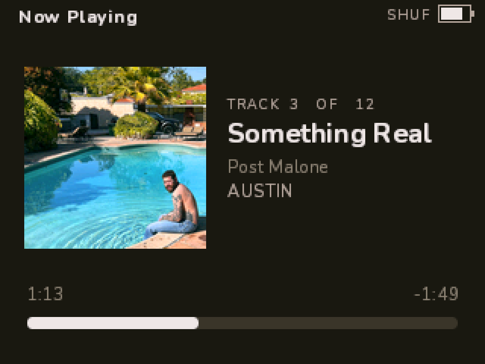</td>
    <td>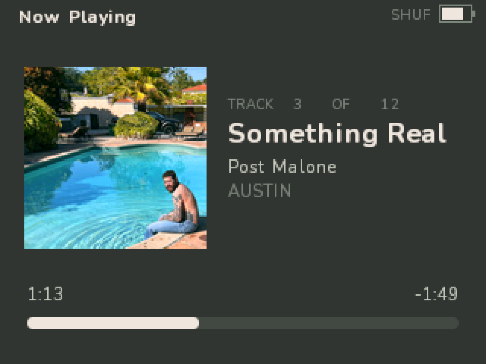</td>
  </tr>
</table>

Linen (warm light), Onyx (warm dark), Sage (dark green-grey), Plaster (pink-beige), Olive
(greige-olive), Umber (espresso), Mushroom (warm greige). Every screen uses the theme's ink and
surface, so the selected row and the Hold banner invert with it. The low-battery red never changes.

## The `core` app

`core` is one program for your computer that does the host side: it puts the music on the iPod in
the layout the firmware reads, bakes the album art, writes the index, and flashes firmware. One
file, no installer.

Download the one for your machine from the
[latest release](https://github.com/BrandonDedolph/ipod-core/releases/latest):

| File | For |
|---|---|
| `core-windows-amd64.exe` | Windows |
| `core-darwin-arm64` | macOS, Apple silicon |
| `core-darwin-amd64` | macOS, Intel |
| `core-linux-amd64` | Linux, x86-64 |
| `core-linux-arm64` | Linux, ARM |

The binaries are attached from v0.1.3 on; for an earlier release, build it with
`cd core/cli && go build -o core ./cmd/core`. On macOS and Linux, `chmod +x` the downloaded file.
The examples below call it `core`.

**The window.** `core-app` is the same thing as a desktop application: one window with an iPod card,
a Music card (folder, Dry run, Sync, Sync + prune), a Firmware card (Check, Update, Flash file,
Backup), Eject, and a log. It ships beside the command line from v0.1.3 as
`core-app-windows-amd64.exe`, `core-app-darwin-arm64`, `core-app-darwin-amd64`,
`core-app-linux-amd64` and `core-app-linux-arm64`. On Windows it asks for Administrator when it
opens (one UAC prompt), because reading the iPod's raw disk needs it; that is also what lets it
flash from the window with no second prompt. Keep `core` in the same folder anyway: a window that
is somehow not elevated runs `core.exe` under Administrator for the flash, and without it the
Firmware card prints the command to run instead. The confirmations are the ones the command line asks for — the device
path typed exactly before a flash, the word `prune` before anything is deleted. It has not been on
a device yet; it drives the same code the commands below do.

**Connect.** Put the iPod in disk mode — Settings, Disk Mode on the device, or hold Select + Play
at power-on — plug it in, and ask what is there:

```
core info
```

That prints the disk, the logical sector size, the partition table and the firmware images, and
never writes. If it says no iPod, `core info --all-disks` lists every disk the OS can see and which
opens were refused. Reading a raw disk needs Administrator on Windows and root on Linux and macOS;
when an open is refused the error prints the exact elevated command to run.

**Music.**

```
core sync --src "C:\Users\you\Music" --dst D:\
core eject D:
```

`--dst` is the iPod's volume root, not its `Music` folder. The source is one folder per album named
`Album - Artist`, one FLAC per track, and playlists, if you keep any, as `.m3u8` files in a
`Playlists/` folder beside the albums.

`sync` copies each track to `Music/Artist - Album/NN. Title.flac`, writes `folder.art` and
`folder.thm` beside it from the file's embedded cover, rewrites the playlists to device paths under
`Music/Playlists/`, creates `CORECFG.DAT` and `CORELOG.BIN` in the volume root if they are missing
(a valid one is never reset, so your settings survive), and writes `Music/CORELIB.IDX` last — last
on purpose, so the index never names files a failed copy did not leave behind. A track already on
the device is skipped when its size matches and its timestamp is within two seconds; `--verify`
compares content instead.

```
core sync --src … --dst D:\ --dry-run       # print the whole plan, write nothing
core sync --src … --dst D:\ --prune --yes   # also remove what is on the device and not in the source
```

Nothing is deleted without `--prune --yes`.

**Firmware.**

```
core update                      # the newest release: download, verify, flash
core flash core.ipod             # a particular image, e.g. one downloaded from a release
core backup                      # the whole firmware partition to a file
core doctor                      # read-only check of the device and its library
```

`update` reads the latest GitHub release, downloads the image, checks it against its own checksum,
and flashes it. Writing the firmware partition needs Administrator on Windows and root on macOS and
Linux. From an ordinary console the download and the check still happen, and then the exact
elevated command is printed: a `core flash` of the downloaded file, first with `--dry-run` so you
can read the plan, then with `--yes`. On Windows, paste it into a Command Prompt opened with "Run as
administrator"; on macOS and Linux, prefix it with `sudo`. `core update` and `core doctor` ship with
the v0.1.3 binaries.

Every flash backs the whole firmware partition up first, writes only this firmware's image and the
one directory row describing it — the Apple preamble, the partition table and Apple's other images
are never touched — and re-reads what it wrote to compare. `--dry-run` prints the plan and opens
nothing for writing.

**What is verified.** The iPod Video 5.5G 80 GB is the only model this firmware has ever booted,
and the only one the app knows. Its flash path has been run on that device: the whole-partition
backup, the write, and the read-back all matched, and `ipodpatcher` read the same image back
afterwards. `core flash` refuses any other iPod unless you pass `--untested-hardware`. Reading,
backing up and syncing are not gated.

**Recovery.** Select + Play at power-on is Apple's disk mode in the boot ROM. Nothing the firmware
or this app writes can remove it, so a bad image is always recoverable: hold it, then flash again.
A backup from `core backup` puts the partition back exactly as it was, Apple's images included:

```
core flash --from-backup fwpart-131475456-….bin
```

`ipodpatcher` remains the documented fallback for flashing and restoring — `ipodpatcher <disk> -wf
core.ipod`, read back with `-rfb` and compared against the image.

## Putting music on it

`core sync` does all of this in one command. What follows is what has to end up on the volume, and
how to put it there by hand. Either way it happens on a computer with the iPod in disk mode, on the
iPod's FAT32 volume.

1. **Folders.** Put each album in its own folder under `Music/`, one FLAC per track. The firmware
   plays FLAC. MP3 files are ignored: the decoder is built but switched off because it cannot keep
   up on this CPU, so `.mp3` files never enter the library.
2. **The index.** Run `tools/build_index.py --src <your Music folder> --out <iPod>/Music/CORELIB.IDX`.
   The firmware looks for `CORELIB.IDX` in `Music/`, or in the volume root if there is no `Music/`
   folder. There is no default output path; pass `--out` yourself. The firmware loads this in one
   read at boot. Rebuild it whenever you add or remove music. Titles, artists, albums, genres and
   durations come from the files' tags through `ffprobe`.
3. **Album art.** Run `tools/coreart.py --thumb <album folder>` (or `--batch <root>` on the tree).
   It writes `folder.art` (120 px, the Now Playing cover) and `folder.thm` (28 px, the list chip)
   next to the tracks from the FLAC's embedded cover. No art file, no chip: the row shows a
   placeholder.
4. **Playlists.** Put `.m3u8` files in `Music/Playlists/`. A path inside that starts with a slash
   is read from the volume root; anything else is read relative to that folder. The firmware reads
   playlists; it cannot write them.
5. **Two files it writes to.** `CORECFG.DAT` (settings and resume) and `CORELOG.BIN` (the event
   log) must exist in the volume root before the first boot: `tools/make_config.py --create
   <iPod>` and `tools/make_log.py --create <iPod>`. The firmware never creates, grows or moves a
   file, so it can only write into space that is already there.

Library limits: 6000 songs, 1024 albums, 512 artists, 128 genres. Past a limit the About page says
"Library too large · some items not shown" in red.

## Battery and charging

The battery in the status strip is an estimate from the cell's voltage. An old cell sags when the
drive spins and rebounds after, so the percentage can move several points in a minute; the
voltage on the About page is steadier.

- **Charging.** Plug in and the charging screen shows the percentage; any button dismisses it, and
  that press does nothing else. The gauge reads the cell, not the charger, so it does not jump to
  full when you plug in.
- **Low.** At 3.7 V a small toast says the battery is low.
- **Very low.** At 3.5 V a full-screen warning: the drive parks whenever playback does not need it,
  and the device stops writing settings and the log until you plug in. Plug in now to keep listening.
- **Empty.** At 3.3 V a goodbye screen, then power off, so the disk is never cut mid-write.

<table>
  <tr>
    <td>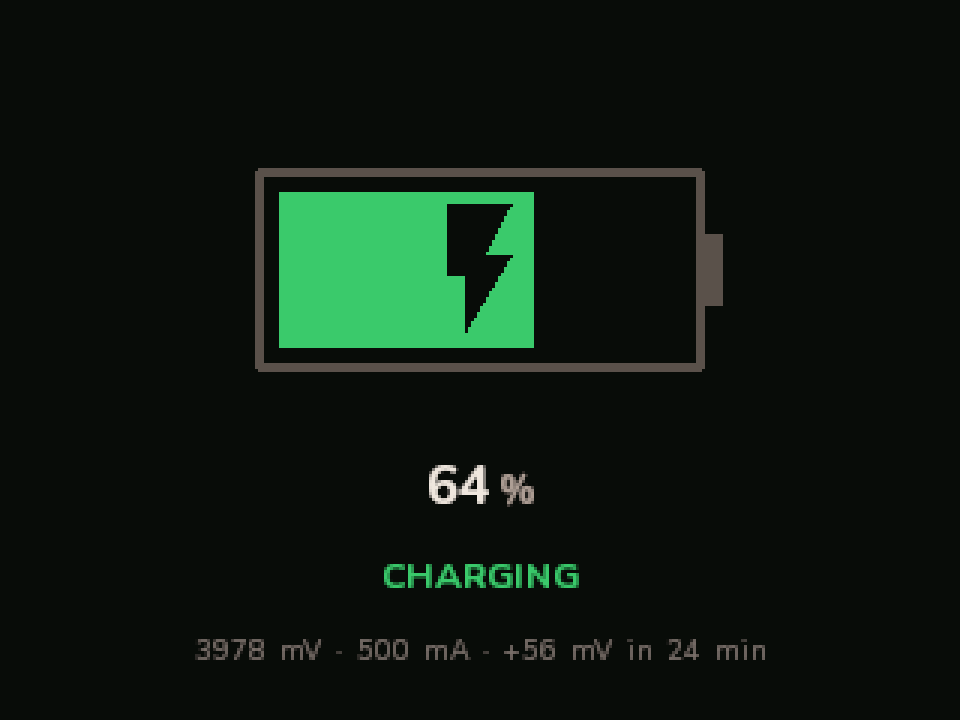</td>
    <td>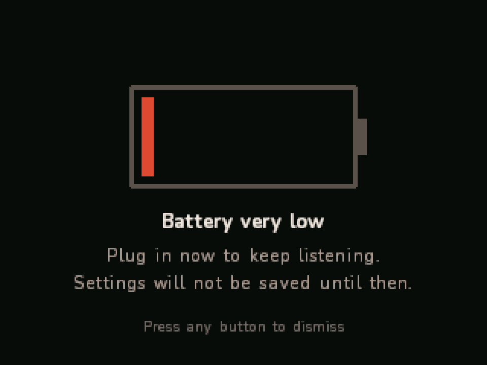</td>
  </tr>
</table>

## Power

- **Backlight.** After the timeout in Display the light dims, then goes off fifteen seconds later.
  Any input brings it back; the press that wakes it from off is not acted on.
- **The drive** spins down after twenty seconds without input as long as nothing is playing, so it
  parks while paused too. It spins up again when the next read needs it; a resume over a parked
  drive spins it up before the music starts.
- **Sleep.** Hold Play two seconds. Playback pauses and the position is saved, the drive parks, the
  screen and backlight go off, the codec powers down. Any button wakes it back where it was.
- **Power off.** Hold Play past five seconds, or leave a sleeping device on battery for thirty
  minutes: it powers itself off. The next press cold boots; with Resume on you come back on the
  same track, paused.

## Disk mode and the files on the drive

Settings, Disk Mode saves everything and reboots into Apple's USB disk mode. From power-on, hold
Select + Play for the same thing from the boot ROM; that works even if the firmware will not boot.

On the volume you will find, besides your music: `Music/CORELIB.IDX` the library index,
`Music/Playlists/` your playlists, `CORECFG.DAT` the settings and resume record in the root, and
`CORELOG.BIN` the 4 MiB event log, also in the root. `tools/make_log.py --dump CORELOG.BIN` prints
the log: every diagnostic line the firmware wrote, with boot boundaries, battery samples and the
audio counters. If you report a problem, that dump is what explains it.

## If something is wrong

- **It will not boot, or the screen is blank.** Hold Select + Play at power-on. That is Apple's disk
  mode, in the boot ROM; the firmware cannot remove it. Then reflash, or restore the backup
  (README, Flash).
- **The library is missing or stale.** Rebuild `CORELIB.IDX`: `core sync`, or `tools/build_index.py`.
- **Settings do not stick.** `CORECFG.DAT` must exist in the volume root; `core sync` creates it, or
  `tools/make_config.py --create <iPod>`.
- **Something else.** Pull `CORELOG.BIN` in disk mode and dump it. Known issues and what is being
  worked on are in [STATUS.md](../STATUS.md).
