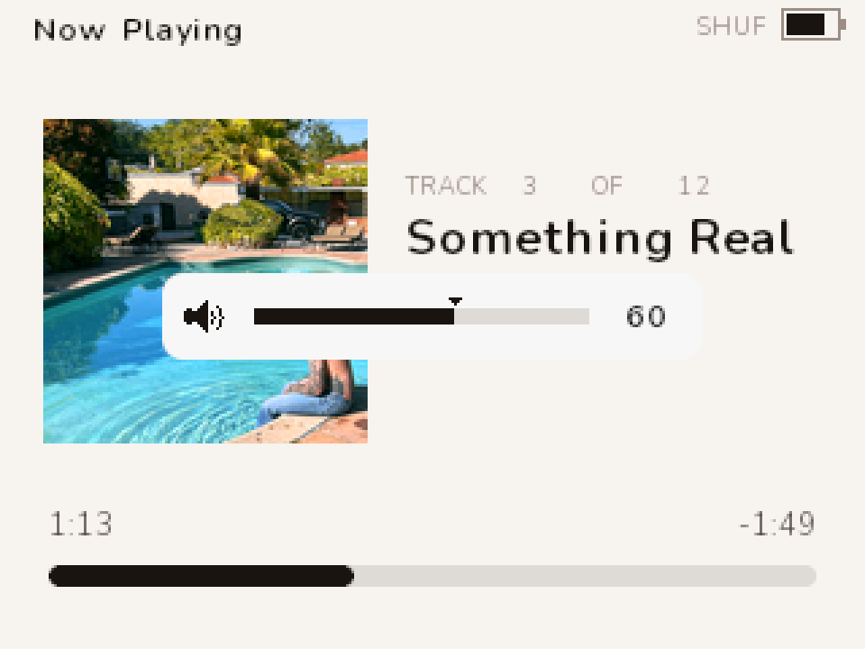
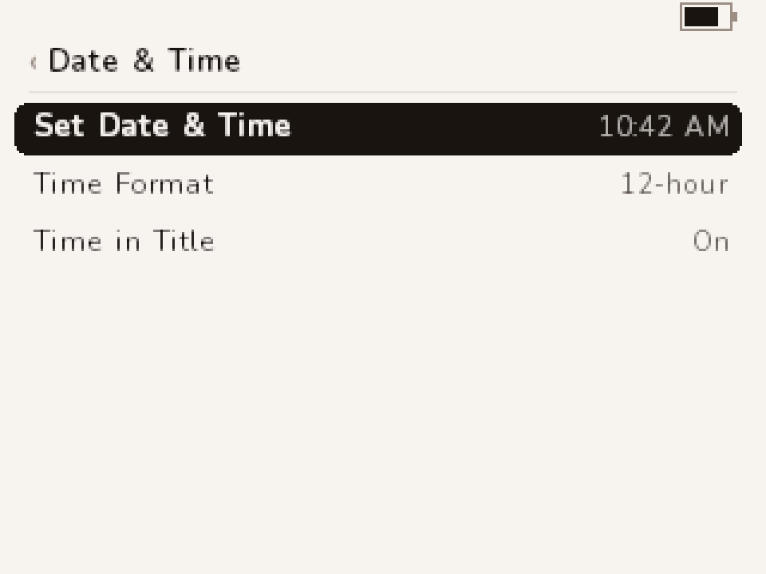
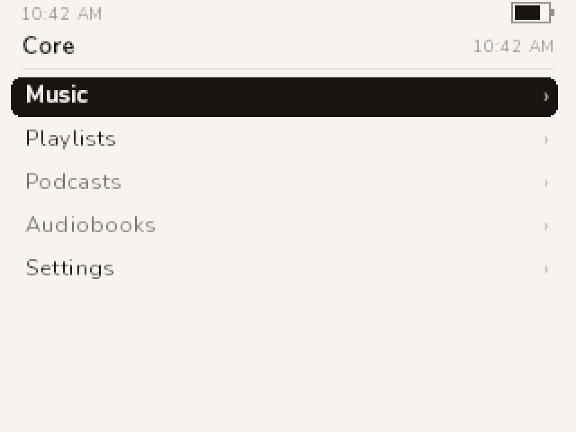

# Using core

This guide describes Core v0.1.3. The device shows its version bottom-right on the boot screen and
in Settings → About; Boot Details shows the full build string.

This is the guide for the person holding the iPod. It covers the controls, every screen, the `core`
app that puts music on the device and flashes it, power, and what to do if something goes wrong.
Building the firmware from source is in the [README](../README.md).

## Controls

The click wheel scrolls. The centre button is Select. Menu is the top of the wheel, Play at the
bottom, Left and Right at the sides. The Hold switch is on the top edge.

| Control | On lists and menus | On Now Playing |
|---|---|---|
| Wheel | Moves the selection | Volume. After a Select tap, seeks |
| Select | Opens the row. On a track, plays it | Tap: scrub mode. Hold: the queue |
| Menu | Back one screen. Hold one second: the main menu | Back to the screen you came from. Hold: the main menu |
| Play | Tap on an album, artist, genre, playlist or song: plays it. Tap elsewhere: pause or resume. Hold two seconds anywhere: sleep. Hold longer: power off | Tap: pause or resume. Hold: sleep, then power off |
| Right | Jumps to Now Playing if a track is loaded, playing or paused | Tap: next track. Hold: fast forward |
| Left | Nothing but the click | Tap: previous track. Hold: rewind |

Play on a highlighted album, artist, genre or playlist starts that list from its first track, and
on a highlighted song it plays that song — whether something was already playing or not, and the
queue is replaced either way. On the Music menu's Shuffle Songs row it deals a fresh shuffle. On
rows that name no music (the main menu, the rest of the Music menu, Settings) and on an empty
list, Play stays pause and resume.

Right on a list pushes Now Playing over it, so Menu brings you back to the exact row you left.
Left and Right are transport — skip on a tap, seek on a hold — only on Now Playing and the queue.
Holding Menu for a second goes to the main menu from wherever you are; a plain tap is still back
one screen.

On any long alphabetical list — Songs, an artist's All Songs, a genre's songs, Artists, Albums,
Playlists, Genres — spinning the wheel fast puts a big letter on screen so you can aim. The letter
stays for just over a second after you stop, and while it is up the wheel moves a **letter** per
click, not a row — so you can stop, read it, and keep going letter by letter. Lift for longer than
that and the letter goes away; the next click is one row again. It is the letter the list is
**sorted by**, which is not always the letter the row starts with: Artists ignore a leading "The",
so The Kid LAROI is under K, and an album is under its own title, not its artist's. Short lists
have no letter: aiming only beats scrolling once a list is longer than about six screens. A name
that starts with a digit, a bracket or an accented letter shows `#` — accented names sort after Z,
so Élan is at the bottom of the list rather than under E.

Hold Play for two seconds to sleep. Keep holding past five seconds and the device powers off
instead. Any button wakes a sleeping device where you left it. A powered-off device cold boots on
the next press. Settings, Playback, Sleep Timer does the same thing on a countdown.

<p align="center"></p>

## The Hold switch

Slide Hold on and a banner takes the top of the screen for a second: a padlock and Locked. Buttons
and the wheel do nothing while it is on; a press shows the banner again. A small padlock stays in
the status strip. Slide it off for the Unlocked banner. Touch the wheel or a button and the banner
goes away at once.

<p align="center"></p>

## The status strip

The band at the top of every list and every Settings screen shows the playing track's name on the
left and the battery on the right, with the padlock between them when Hold is on. When nothing is
loaded the left side is blank — or shows the time, if Time in Title is on (Settings > Date & Time).
The track name always wins while something is playing: the clock then lives in the main menu's
header instead, where it never has to share room with a title. While the sleep timer is running, SLEEP and the minutes left sit
beside the battery and the track name shortens to make room. On Now Playing the band reads Now
Playing or Paused, with SHUF (or SHUF·ALB for Shuffle Albums) and RPT tokens when shuffle or
repeat are on, and SLEEP after them.

## Browsing

<table>
  <tr>
    <td></td>
    <td></td>
    <td></td>
  </tr>
</table>

**Main menu.** Music, Playlists, Settings, and Now Playing once something is loaded. Podcasts and
Audiobooks are greyed placeholders.

**Music.** Playlists, Artists, Albums, Songs, Shuffle Songs, Genres, Search. Composers and
Audiobooks are greyed placeholders. The list is nine rows in an eight-row window, so it scrolls.

**Albums** lists every album with its cover chip and artist. Select opens the album: cover, title,
artist, track count and length, then the tracks with their numbers and durations. Select on a
track plays the album from there; Play on an album row plays it without opening it.

**Artists** lists artists; Select shows that artist's albums with an All Songs row at the top that
is the whole discography, album on the sub-line.

**Songs** is every song in the library. **Genres** lists genres A→Z with a count each. **Shuffle
Songs** deals the whole library and starts playing.

**Playlists** are `.m3u8` files you put in `Music/Playlists/` on the disk (see Putting music on
it). Select one to see its tracks; Select a track to play the playlist from there.

The header's right side shows where you are in the list, for example `6 / 17`. A long title
scrolls while it is selected.

### Search

<table>
  <tr>
    <td></td>
    <td></td>
  </tr>
</table>

Music → Search. The wheel moves along a strip of letters, digits and three words — SPACE, DEL and
DONE — and Select types the one under the cursor. Every keystroke searches; the four best matches
appear under the strip as you type, and the header counts them. DONE hands the wheel to the full
list.

| | In the picker | In the results |
|---|---|---|
| Wheel | Moves along the strip, wrapping | Moves the selection |
| Select | Types the character. On DEL, deletes one. On DONE, opens the results | Opens the row |
| Right | A space — never a skip, and holding it types one space, not a seek | Jumps to Now Playing |
| Left | Deletes one character | Nothing |
| Menu | Back to Music, keeping what you typed | Back to the picker, keeping the results |
| Play | Pause or resume: there is no row under the cursor | Plays the row, as Play does on the list it came from |

Play in the results starts the row's queue rather than opening it: an artist's whole discography,
an album or a playlist from its first track, a song in its album. Holding Menu for a second still
goes to the main menu, and what you typed is still there when you come back.

It matches anywhere in a name, not just the start, but names that **start** with what you typed
come first — and artists, then albums, then playlists, then songs, so one artist is never buried
under two hundred tracks. Capitals do not matter, accents do not matter (`elan` finds *Élan*) and
neither do apostrophes, which is just as well because the strip has no key for one: `its over`
finds *It's Over*. A leading space and a double space are ignored.

Select a result and it does what the same row would do anywhere else: a **song** plays, in its
album, so Next is the rest of the record; an **artist** opens their albums; an **album** opens its
tracklist; a **playlist** opens its tracks. Menu comes back to the results every time. A song the
index lists but the disk no longer has is greyed, and Select does nothing on it.

Above two hundred matches the list stops and the corner says how many there really are — type
another letter. Your query survives leaving the screen and comes back when you return, until the
device is powered off. The first time you open Search after a boot it reads the Playlists folder,
which can wake a sleeping disk for a moment.

## Now Playing

<table>
  <tr>
    <td></td>
    <td></td>
    <td></td>
  </tr>
</table>

The cover, then the eyebrow `TRACK 3 OF 12` (your place in the queue), the title, the artist, the
album. At the bottom the elapsed time, the time remaining, and the progress bar.

**Volume.** Turn the wheel. A bar appears for a moment; the speaker icon grows sound waves as it
goes up and shows a cross at zero. If you have set a Volume Limit, a small triangle sits over the
bar at the limit and the wheel stops there — the bar still runs to 100, so you can see how much
you are giving up.

**Scrubbing.** Tap Select. The wheel now moves the play position five seconds per click, more per
click the faster you turn. The left time shows where you are aiming and the right time shows how
far that is from where playback is, as a signed figure. Stop turning and it seeks after about four
tenths of a second. Leave it alone for four seconds and the wheel goes back to volume.

**Fast forward and rewind.** Hold Right or Left. The left time and the bar show where you are
heading and the right time how far that is, as a signed figure. It moves five seconds a quarter
second at first, then fifteen after two seconds of holding, thirty after five and sixty after ten,
so a long recording is crossable without letting go. It stops at the ends of the track and goes no
further. Let go and it seeks there, once — the audio does not move while you hold: a hold walked to
the end lands at the end, and the track then finishes normally. Let go before it has moved anywhere
at all — a press only just longer than a tap, or a hold that had nowhere to go because you were
already at the end — and nothing happens. If the track ends under your thumb and the next one
starts, the seek is dropped rather than carried into a track you have not heard. A quick tap skips
instead, and because the length of the press is what tells the two apart, the skip happens when you
let go.

**The queue.** Hold Select for about half a second. The queue view lists the tracks of the list you
played from, in that list's own order, with the playing row marked — so with shuffle on, the next
row is not what plays next. Select a row to jump to it; Menu returns to Now Playing. Left and
Right skip here as well, and a hold seeks; the queue has no time readout, so you see the result
when you let go.

**Shuffle and repeat** are in Settings, Playback. They show as SHUF, SHUF·ALB, RPT or RPT1 in the
top band, followed by SLEEP and the minutes left when the sleep timer is running.

**When a track ends** while you are browsing, the name in the status strip changes. Nothing pops
up.

**Headphones.** Pull the plug while a track plays and it pauses; plugging back in does not start
it again — press Play. Nothing on the cable can control playback: this iPod's jack has no button
line, and its fourth conductor is a video output, not a remote. *Not switched on in this release.*
The pin that senses the plug is documented but has never been read on a real device, and sensing
it backwards would stop the music every time you plugged headphones **in** — so it stays off until
the reading is taken. Settings, About shows the pin live (`JACK`) for exactly that purpose.

## Settings

<table>
  <tr>
    <td></td>
    <td></td>
    <td></td>
    <td></td>
  </tr>
</table>

Select a row to open it. On a slider, Select starts editing, the wheel changes the value, and
Select or Menu finishes. Every change is saved to the disk — except the sleep timer, which only
ever lives in memory; if the drive happens to be asleep the save waits until it next spins, or
until the device sleeps or powers off, so leaving Settings never makes you wait.

- **Playback.** Shuffle Off, Songs or Albums. Songs shuffles the tracks of the list you played
  from. Albums keeps each album together: the tracks of the album you are on that are in that list
  play in track order, wherever they sit in the list, then another album from the same list at
  random, and so on until every album in it has played. It regroups the list, not the disk — tracks
  the list does not hold are not fetched to complete an album. Playing one album from the browser
  with Albums on simply plays it in order. Shuffle Songs on the Music menu always shuffles songs,
  whichever setting is on, because that list IS the shuffle.
  Repeat Off, All, or One; with Albums on, Repeat All starts the whole list again in a new album
  order, and Repeat One still repeats the one track. Resume on or off: with Resume on, the
  next boot comes back on the track you were on, paused at the same position, in the same queue.
  Turning Resume off also forgets the stored position. Sleep Timer: Off, 15, 30, 60, 90 or 120
  minutes. Select cycles the value and starts the countdown at once, so it takes six presses to
  get back to Off. While it runs, SLEEP and the minutes left show in the top band. When it runs
  out, playback pauses and the device sleeps as if you had held Play; the next press wakes it
  paused, where you left off. It is not remembered across a restart, and any sleep or a Reset
  turns it off.
- **Sound.** Volume, Volume Limit, EQ, Bass, Treble and Balance. These drive the WM8758B codec
  directly.
  - **Volume Limit** is a ceiling on the volume, 10% to 100%, and 100% means no limit. Set it
    below where the volume is now and the volume comes down with it at once. On Now Playing a
    triangle marks it on the volume bar and the wheel will not go past it. There is no
    combination or passcode: anyone who can reach Settings can move it back. It caps what the
    firmware asks of the headphone amplifier — a different pair of headphones, or an EQ preset
    that boosts, still changes how loud it actually is.
  - **EQ** is Off or one of seventeen presets: Acoustic, Bass Booster, Bass Reducer, Classical,
    Dance, Electronic, Hip-Hop, Jazz, Loudness, Pop, R&B, Rock, Small Speakers, Spoken Word,
    Treble Booster, Treble Reducer, Vocal Booster. Select cycles through them. A preset is a full
    five-band curve on the codec's own equaliser.
  - **A boosting preset plays quieter overall, on purpose.** The whole track is turned down by
    exactly the preset's largest boost, so a loud passage cannot distort where the curve lifts it.
    The amount is not small: 3 dB for Jazz; 4 for Acoustic, Classical, Pop, Spoken Word and Vocal
    Booster; 5 for Dance, Electronic, R&B, Rock and Small Speakers; 6 for Bass Booster, Hip-Hop and
    Treble Booster; **7 for Loudness**, which makes Loudness the quietest setting on the list
    despite its name — it shapes the curve for quiet listening, it does not add level. Bass Reducer
    and Treble Reducer only cut, so they cost nothing. Turn the wheel up to make up the difference;
    that is what the drop is there to leave room for.
  - **Bass and Treble** are plus or minus 12 dB. While an EQ preset is on they are greyed and show
    the preset's own bass and treble, because the codec has one bass control and one treble
    control and the preset is using them; the wheel will not move them. Set EQ to Off and your own
    values come straight back, exactly as you left them. They pay for a boost the same way a preset
    does — Bass at +6 turns everything down 6 dB, and at +12 a full 12 dB, which is a large drop
    (roughly half as loud). A cut costs nothing.
- **Theme.** Seven palettes. The current one is marked; Select switches at once.
- **Display.** Backlight: Never, or 5, 10, 15, 30 or 60 seconds after the last input. At the
  timeout the light drops to a quarter of your brightness, and fifteen seconds later it goes off.
  Brightness: 1 to 32, shown as a percentage.
- **Date & Time.** The iPod has a clock that keeps running while it is off. Three rows:
  - **Set Date & Time** opens the editor below: six plates (year, month, day, hour, minute, AM/PM,
    or five in 24-hour mode). The wheel changes the selected plate, Select confirms it and moves to
    the next, Select on the last one sets the clock, and **Menu cancels without changing anything**.
    The year stops at 2001 and 2099; every other field wraps. The day follows the month — step
    January's 31st into February and it becomes the 28th.
  - **Time Format**: 12-hour or 24-hour. It changes every clock on the device.
  - **Time in Title**: with it on, the time shows in the top band when nothing is playing, and in
    the main menu's header always.

  Normally you never open this: `core sync`, `core install` and `core eject` write the computer's
  time into the iPod's settings file, and the iPod takes it at its **next boot** — it cannot be
  told the time while it is plugged in, because on the cable it is Apple's disk mode answering the
  computer, not this firmware. One exception: a clock that is already running more than ten minutes
  AHEAD is left alone rather than dragged backwards by a stamp that might be days old, so if the
  time is far in the future, set it by hand.

<table>
  <tr>
    <td></td>
    <td></td>
    <td></td>
  </tr>
</table>

- **About.** The firmware version, model, song, album and artist counts, storage free, battery
  percentage and voltage, the event log's state, and the headphone jack's switch — `JACK 1` when a
  plug is seated, `JACK 0` when it is not, followed by `n` and the number of times it has changed
  since power-on.
- **Boot Details.** The full build string, how long the last cold boot took and where it went
  (LCD, disk, library, resume, other), the decode cost against real time, audio underruns, and the
  disk addresses of the settings file and the log. Reading it never wakes a sleeping drive. DECODE
  is the percentage of one second of CPU that one second of audio costs — measured against the
  playing track's own sample rate, and drawn in red past 80 %, where a slow disk refill becomes an
  audible gap. It is the number to watch on an MP3: the MP3 decoder is new and costs about 1.7x
  what FLAC does.
- **Disk Mode.** Saves everything and reboots into Apple's USB disk mode.
- **Reset Settings.** Back to the defaults, saved. The clock keeps running: the time the computer
  last wrote is kept across a reset and applied again at the next boot.

## Themes

<table>
  <tr>
    <td></td>
    <td></td>
    <td></td>
  </tr>
</table>

Linen (warm light), Onyx (warm dark), Sage (dark green-grey), Plaster (pink-beige), Olive
(greige-olive), Umber (espresso), Mushroom (warm greige). Every screen uses the theme's ink and
surface, so the selected row and the Hold banner invert with it. The low-battery red never changes.

## The `core` app

`core` is one program for your computer that does the host side: it puts the music on the iPod in
the layout the firmware reads, bakes the album art, writes the index, and flashes firmware. One
file, no installer.

Download the one for your machine from the
[latest release](https://github.com/BrandonDedolph/ipod-core/releases/latest):

| File | For |
|---|---|
| `core-windows-amd64.exe` | Windows |
| `core-darwin-arm64` | macOS, Apple silicon |
| `core-darwin-amd64` | macOS, Intel |
| `core-linux-amd64` | Linux, x86-64 |
| `core-linux-arm64` | Linux, ARM |

The binaries are attached from v0.1.3 on; for an earlier release, build it with
`cd core/cli && go build -o core ./cmd/core`. On macOS and Linux, `chmod +x` the downloaded file.
The examples below call it `core`.

**The window.** `core-app` is the same thing as a desktop application: one window with an iPod card,
a Music card (folder, Dry run, Sync, Sync + prune), a Firmware card (Check, Update, Flash file,
Backup), Eject, and a log. It ships beside the command line from v0.1.3 as
`core-app-windows-amd64.exe`, `core-app-darwin-arm64`, `core-app-darwin-amd64`,
`core-app-linux-amd64` and `core-app-linux-arm64`. On Windows it asks for Administrator when it
opens (one UAC prompt), because reading the iPod's raw disk needs it; that is also what lets it
flash from the window with no second prompt. Keep `core` in the same folder anyway: a window that
is somehow not elevated runs `core.exe` under Administrator for the flash, and without it the
Firmware card prints the command to run instead. The confirmations are the ones the command line asks for — the device
path typed exactly before a flash, the word `prune` before anything is deleted. It has not been on
a device yet; it drives the same code the commands below do.

<p align="center"></p>

**Connect.** Put the iPod in disk mode — Settings, Disk Mode on the device, or hold Select + Play
at power-on — plug it in, and ask what is there:

```
core info
```

That prints the disk, the logical sector size, the partition table and the firmware images, and
never writes. If it says no iPod, `core info --all-disks` lists every disk the OS can see and which
opens were refused. Reading a raw disk needs Administrator on Windows and root on Linux and macOS;
when an open is refused the error prints the exact elevated command to run.

**Music.**

```
core sync --src "C:\Users\you\Music" --dst D:\
core eject D:
```

`--dst` is the iPod's volume root, not its `Music` folder. The source is one folder per album named
`Album - Artist`, one FLAC or MP3 per track, and playlists, if you keep any, as `.m3u8` files in a
`Playlists/` folder beside the albums.

`sync` copies each track to `Music/Artist - Album/NN. Title.flac` (or `.mp3` — nothing is
converted, each file keeps its own format), writes `folder.art` and
`folder.thm` beside it from the file's embedded cover, rewrites the playlists to device paths under
`Music/Playlists/`, creates `CORECFG.DAT` and `CORELOG.BIN` in the volume root if they are missing
(a valid one is never reset, so your settings survive), **sets the iPod's clock**, and writes
`Music/CORELIB.IDX` last — last on purpose, so the index never names files a failed copy did not
leave behind. A track already on
the device is skipped when its size matches and its timestamp is within two seconds; `--verify`
compares content instead.

```
core sync --src … --dst D:\ --dry-run       # print the whole plan, write nothing
core sync --src … --dst D:\ --prune --yes   # also remove what is on the device and not in the source
```

Nothing is deleted without `--prune --yes`.

**The clock.** `sync`, `install` and `eject` all write your computer's current time (and its time
zone) into `CORECFG.DAT`, and the iPod picks it up at its **next boot**. It cannot be told the time
while it is plugged in: on the cable it is Apple's disk mode answering, not this firmware. `eject`
stamps last, immediately before the volume goes away, which is why it is the one that matters —
unplug, the iPod reboots, and the clock is seconds old. Nothing else in the file is touched: the
stamp rewrites one of its two records and copies everything else across byte for byte. `core doctor`
prints the stamp and whether the device has taken it yet.

**Firmware.**

```
core update                      # the newest release: download, verify, flash
core flash core.ipod             # a particular image, e.g. one downloaded from a release
core backup                      # the whole firmware partition to a file
core doctor                      # read-only check of the device and its library
```

`update` reads the latest GitHub release, downloads the image, checks it against its own checksum,
and flashes it. Writing the firmware partition needs Administrator on Windows and root on macOS and
Linux. From an ordinary console the download and the check still happen, and then the exact
elevated command is printed: a `core flash` of the downloaded file, first with `--dry-run` so you
can read the plan, then with `--yes`. On Windows, paste it into a Command Prompt opened with "Run as
administrator"; on macOS and Linux, prefix it with `sudo`. `core update` and `core doctor` ship with
the v0.1.3 binaries.

Every flash backs the whole firmware partition up first, writes only this firmware's image and the
one directory row describing it — the Apple preamble, the partition table and Apple's other images
are never touched — and re-reads what it wrote to compare. `--dry-run` prints the plan and opens
nothing for writing.

**What is verified.** The iPod Video 5.5G 80 GB is the only model this firmware has ever booted,
and the only one the app knows. Its flash path has been run on that device: the whole-partition
backup, the write, and the read-back all matched, and `ipodpatcher` read the same image back
afterwards. `core flash` refuses any other iPod unless you pass `--untested-hardware`. Reading,
backing up and syncing are not gated.

**Recovery.** Select + Play at power-on is Apple's disk mode in the boot ROM. Nothing the firmware
or this app writes can remove it, so a bad image is always recoverable: hold it, then flash again.
A backup from `core backup` puts the partition back exactly as it was, Apple's images included:

```
core flash --from-backup fwpart-131475456-….bin
```

`ipodpatcher` remains the documented fallback for flashing and restoring — `ipodpatcher <disk> -wf
core.ipod`, read back with `-rfb` and compared against the image.

## Putting music on it

`core sync` does all of this in one command. What follows is what has to end up on the volume, and
how to put it there by hand. Either way it happens on a computer with the iPod in disk mode, on the
iPod's FAT32 volume.

1. **Folders.** Put each album in its own folder under `Music/`, one FLAC or MP3 per track. Both
   play, and nothing is converted either way. MP3 means MPEG-1, MPEG-2 or MPEG-2.5 Layer III, at
   any constant or variable bitrate — the only exclusion is the low sample rates (8, 11.025, 12 and
   16 kHz, which some spoken-word files use), because the iPod's DAC cannot be clocked there; such
   a file appears in the list but will not start.
2. **The index.** Run `tools/build_index.py --src <your Music folder> --out <iPod>/Music/CORELIB.IDX`.
   The firmware looks for `CORELIB.IDX` in `Music/`, or in the volume root if there is no `Music/`
   folder. There is no default output path; pass `--out` yourself. The firmware loads this in one
   read at boot. Rebuild it whenever you add or remove music. Titles, artists, albums, genres and
   durations come from the files' tags through `ffprobe` — Vorbis comments in a FLAC, ID3 in an
   MP3.
3. **Album art.** Run `tools/coreart.py --thumb <album folder>` (or `--batch <root>` on the tree).
   It writes `folder.art` (120 px, the Now Playing cover) and `folder.thm` (28 px, the list chip)
   next to the tracks from the FLAC's embedded cover. No art file, no chip: the row shows a
   placeholder.
4. **Playlists.** Put `.m3u8` files in `Music/Playlists/`. A path inside that starts with a slash
   is read from the volume root; anything else is read relative to that folder. The firmware reads
   playlists; it cannot write them.
5. **Two files it writes to.** `CORECFG.DAT` (settings and resume) and `CORELOG.BIN` (the event
   log) must exist in the volume root before the first boot: `tools/make_config.py --create
   <iPod>` and `tools/make_log.py --create <iPod>`. The firmware never creates, grows or moves a
   file, so it can only write into space that is already there.

Library limits: 6000 songs, 1024 albums, 512 artists, 128 genres. Past a limit the About page says
"Library too large · some items not shown" in red.

## Battery and charging

The battery in the status strip is an estimate from the cell's voltage. An old cell sags when the
drive spins and rebounds after, so the percentage can move several points in a minute; the
voltage on the About page is steadier.

- **Charging.** Plug in and the charging screen shows the percentage; any button dismisses it, and
  that press does nothing else. The gauge reads the cell, not the charger, so it does not jump to
  full when you plug in.
- **Low.** At 3.7 V a small toast says the battery is low.
- **Very low.** At 3.5 V a full-screen warning: the drive parks whenever playback does not need it,
  and the device stops writing settings and the log until you plug in. Plug in now to keep listening.
- **Empty.** At 3.3 V a goodbye screen, then power off, so the disk is never cut mid-write.

<table>
  <tr>
    <td></td>
    <td></td>
  </tr>
</table>

## Power

- **Backlight.** After the timeout in Display the light dims, then goes off fifteen seconds later.
  Any input brings it back; the press that wakes it from off is not acted on.
- **The drive** spins down after twenty seconds without input as long as nothing is playing, so it
  parks while paused too. It spins up again when the next read needs it; a resume over a parked
  drive spins it up before the music starts.
- **Sleep.** Hold Play two seconds. Playback pauses and the position is saved, the drive parks, the
  screen and backlight go off, the codec powers down. Any button wakes it back where it was.
- **Sleep timer.** Settings, Playback, Sleep Timer arms a countdown of 15 to 120 minutes; SLEEP and
  the minutes left show in the top band. It runs whatever the device is doing — playing, paused,
  or with Hold on and the thing in your pocket — and nothing you press resets it: it is a duration,
  not an idle timeout. When it runs out the device does exactly what a held Play does, except that
  it wakes **paused**: you fell asleep, so the next press is where was I, not play. Thirty minutes
  later, on battery, it powers itself off like any sleeping device. Waking it with Hold on needs
  Hold off first, as always. The timer reads Off again afterwards, and after any restart.
  screen and backlight go off, the codec powers down. Any button wakes it back where it was. (Once
  jack sensing is switched on — see Now Playing — headphones pulled out while it sleeps make it
  wake paused instead of resuming, even if you plug them back in before waking it.)
- **Power off.** Hold Play past five seconds, or leave a sleeping device on battery for thirty
  minutes: it powers itself off. The next press cold boots; with Resume on you come back on the
  same track, paused.

## Disk mode and the files on the drive

Settings, Disk Mode saves everything and reboots into Apple's USB disk mode. From power-on, hold
Select + Play for the same thing from the boot ROM; that works even if the firmware will not boot.

On the volume you will find, besides your music: `Music/CORELIB.IDX` the library index,
`Music/Playlists/` your playlists, `CORECFG.DAT` the settings and resume record in the root, and
`CORELOG.BIN` the 4 MiB event log, also in the root. `tools/make_log.py --dump CORELOG.BIN` prints
the log: every diagnostic line the firmware wrote, with boot boundaries, battery samples and the
audio counters. If you report a problem, that dump is what explains it.

## If something is wrong

- **It will not boot, or the screen is blank.** Hold Select + Play at power-on. That is Apple's disk
  mode, in the boot ROM; the firmware cannot remove it. Then reflash, or restore the backup
  (README, Flash).
- **The library is missing or stale.** Rebuild `CORELIB.IDX`: `core sync`, or `tools/build_index.py`.
- **Settings do not stick.** `CORECFG.DAT` must exist in the volume root; `core sync` creates it, or
  `tools/make_config.py --create <iPod>`.
- **The clock says Not set, or is wrong.** A flat battery resets it — the clock runs off the same
  cell. Plug the iPod in and run `core sync` or `core eject` (either sets it), then boot the device
  once: the time arrives on that boot, not while it is on the cable. A clock running more than ten
  minutes AHEAD is deliberately left alone by that path; set it in Settings > Date & Time.
- **Something else.** Pull `CORELOG.BIN` in disk mode and dump it. Known issues and what is being
  worked on are in [STATUS.md](../STATUS.md).
